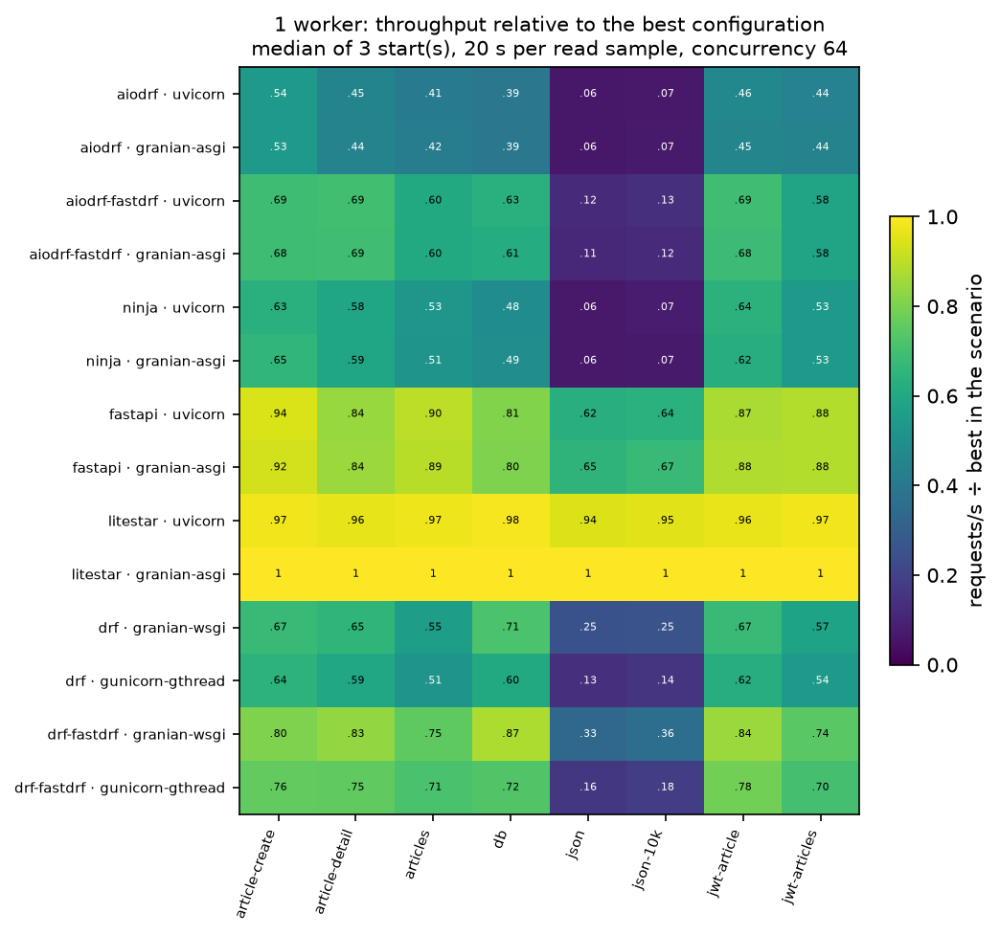

# Python API stack benchmarks

Seven profiles serving the same JSON and PostgreSQL workloads: FastAPI with
Pydantic and SQLAlchemy async, Litestar with msgspec and SQLAlchemy async,
Django Ninja, DRF, DRF with fastdrf, aiodrf and aiodrf with fastdrf.
Each profile is measured on two servers with one worker.

## Latest results

[REPORT.md](REPORT.md) contains the 4 October 2026 run: **7 framework profiles,
14 framework/server pairs, 8 scenarios, 1 worker and 3 independent starts per
group**. All **336 samples / 112 groups passed**, including response contracts,
JWT rejection and persisted writes. Timed loads and warmups had no HTTP errors
or timeouts. Median throughput spread between starts: **±0.8%**.
The run took 126.9 minutes. The highest recorded external-service CPU
utilization was 22.6% of assigned CPUs; oha's was 3.8%.

| Setting | Value |
| --- | --- |
| ASGI baseline | Uvicorn 0.54.0, 1 worker, uvloop + httptools |
| ASGI Granian | Granian 2.8.4, 1 worker, uvloop; default auto runtime (st, 1 runtime thread), backlog/BP 1024 |
| WSGI baseline | Gunicorn 26.2.0, 1 gthread worker, 8 threads; auto parser resolves to Python (no gunicorn_h1c) |
| WSGI Granian | Granian 2.8.4, 1 worker, mt, 1 runtime thread, 4 blocking threads, backpressure 128, backlog 128, uvloop |
| Transport | Direct HTTP/1.1 keep-alive; no proxy, TLS, compression or access log |
| Load | oha, 64 concurrent connections; 2 s warmup + 20 s reads; 3,000 requests per write sample |
| Dataset | PostgreSQL 18.6: 1,000 articles, 10 authors, 5 tags, 1 JWT user |
| Connection pool | At most 10 per worker; SQLAlchemy max_overflow=0; no PgBouncer |
| CPU layout | Server CPU 0, load CPUs 8–15, PostgreSQL CPUs 16–17; runner CPU 18 |
| Host | Intel Core i7-14700F, 28 logical CPUs, 123 GiB RAM; Linux 7.0.0; powersave governor |
| Python | CPython 3.14.7, GIL enabled |
| Frameworks | Django 6.1.1, DRF 3.18.1, aiodrf 0.0.4, fastdrf 0.5.0, Ninja 1.7.1, FastAPI 0.142.2, Litestar 2.24.0 |
| Serialization / ORM | Pydantic 2.13.5, msgspec 0.22.0, SQLAlchemy 2.1.3; [dependencies](report/requirements.lock) |

All results below are fresh measurements from this run. No earlier tuning
samples were merged. Granian ASGI follows the maintainer's uvloop/defaults
recommendation; Granian WSGI uses the BP128/backlog128 profile selected in
the preceding direct-client experiments. See [server commands and rationale](docs/servers.md).

### Uvicorn ASGI / Gunicorn gthread WSGI

Requests per second, median of three independent starts:

| Scenario | FastAPI | Litestar | Ninja | DRF | DRF + fastdrf | aiodrf | aiodrf + fastdrf |
| --- | ---: | ---: | ---: | ---: | ---: | ---: | ---: |
| `json` | 23,568 | 35,572 | 2,543 | 5,208 | 6,120 | 2,422 | 4,521 |
| `json-10k` | 20,871 | 31,093 | 2,424 | 4,862 | 5,913 | 2,284 | 4,367 |
| `db` | 2,218 | 2,694 | 1,328 | 1,654 | 1,992 | 1,081 | 1,733 |
| `articles` | 744 | 802 | 437 | 426 | 587 | 342 | 501 |
| `article-detail` | 1,086 | 1,235 | 753 | 771 | 973 | 579 | 898 |
| `article-create` | 530 | 551 | 357 | 364 | 429 | 305 | 389 |
| `jwt-article` | 802 | 889 | 590 | 574 | 722 | 429 | 638 |
| `jwt-articles` | 586 | 645 | 356 | 358 | 465 | 292 | 386 |

### Granian ASGI / Granian WSGI

Requests per second, median of three independent starts:

| Scenario | FastAPI | Litestar | Ninja | DRF | DRF + fastdrf | aiodrf | aiodrf + fastdrf |
| --- | ---: | ---: | ---: | ---: | ---: | ---: | ---: |
| `json` | 24,469 | 37,603 | 2,520 | 9,468 | 12,506 | 2,414 | 4,145 |
| `json-10k` | 21,952 | 32,604 | 2,395 | 8,396 | 11,793 | 2,322 | 3,918 |
| `db` | 2,206 | 2,732 | 1,344 | 1,956 | 2,396 | 1,089 | 1,694 |
| `articles` | 736 | 824 | 428 | 458 | 619 | 347 | 501 |
| `article-detail` | 1,090 | 1,285 | 759 | 839 | 1,074 | 575 | 891 |
| `article-create` | 523 | 563 | 370 | 381 | 453 | 303 | 388 |
| `jwt-article` | 810 | 919 | 571 | 618 | 780 | 421 | 631 |
| `jwt-articles` | 584 | 660 | 354 | 382 | 493 | 296 | 387 |

### Effect of changing the server

Throughput change from Uvicorn to Granian ASGI, or from Gunicorn gthread to
Granian WSGI, within the same framework. Positive means higher throughput.

| Scenario | FastAPI | Litestar | Ninja | DRF | DRF + fastdrf | aiodrf | aiodrf + fastdrf |
| --- | ---: | ---: | ---: | ---: | ---: | ---: | ---: |
| `json` | +3.8% | +5.7% | -0.9% | +81.8% | +104.4% | -0.3% | -8.3% |
| `json-10k` | +5.2% | +4.9% | -1.2% | +72.7% | +99.5% | +1.7% | -10.3% |
| `db` | -0.5% | +1.4% | +1.2% | +18.2% | +20.3% | +0.7% | -2.3% |
| `articles` | -1.0% | +2.7% | -2.1% | +7.3% | +5.4% | +1.3% | 0.0% |
| `article-detail` | +0.4% | +4.0% | +0.7% | +8.9% | +10.4% | -0.7% | -0.8% |
| `article-create` | -1.2% | +2.1% | +3.7% | +4.9% | +5.8% | -0.5% | -0.2% |
| `jwt-article` | +1.0% | +3.4% | -3.1% | +7.6% | +8.0% | -1.8% | -1.0% |
| `jwt-articles` | -0.3% | +2.3% | -0.5% | +6.8% | +5.9% | +1.3% | +0.2% |

[Server comparison with p99](report/server-comparison.csv) ·
[fastdrf comparison on each server](report/fastdrf-comparison.csv)

The server change has different effects across these stacks:

- **DRF-fastdrf on WSGI:** Granian raises throughput by 104.4% on `json`,
  99.5% on `json-10k`, 20.3% on `db`, 5.4% on `articles` and 8.0% on
  `jwt-article`. Its median p99 is lower in all eight scenarios.
- **FastAPI on ASGI:** the two JSON workloads gain 3.8% and 5.2% with Granian.
  Database workload throughput changes by only −1.2% to +1.0%, but read p99
  rises by 37.7–90.3%. For example, `jwt-articles` is 214 ms on Uvicorn versus
  407 ms on Granian. Write p99 improves from 225 to 173 ms.
- **Litestar on ASGI:** Granian throughput is 1.4–5.7% higher. The `db` p99,
  however, rises from 29.0 to 64.6 ms; higher throughput alone does not establish
  a better latency profile.
- **aiodrf-fastdrf on ASGI:** Granian is 8.3% and 10.3% slower on the two JSON
  workloads. Database throughput changes range from −2.3% to +0.2%.

These are medians from this run, not guarantees for other traffic patterns.
The per-group spread and latency columns matter when choosing a server.



The detailed report includes each group's min–max spread, p99 and CPU use.
[summary.csv](report/summary.csv) also includes p50/p95 and memory use.
Near ties must be read alongside that spread; three
starts are not a confidence interval. Granian WSGI uses four blocking threads
while Gunicorn uses eight gthreads, so this compares configured deployments,
not an isolated HTTP parser change. The ORMs, serializers and framework
request paths also differ. The aiodrf-fastdrf profile includes aiodrf runtime
options; its gain is not attributable to fastdrf alone.

The workload is closed-loop with 64 persistent connections on localhost.
It does not establish overload behavior, internet latency or multi-worker
scaling. PostgreSQL uses synchronous_commit=off for every profile; write
results do not include durable-commit latency.

## Previous reports

- [3 October 2026: seven frameworks, Uvicorn/Gunicorn](archive/2026-10-03-seven-frameworks/REPORT.md)
  — [manifest](archive/2026-10-03-seven-frameworks/report/manifest.json),
  [samples](archive/2026-10-03-seven-frameworks/report/samples.json).
  Two starts and 10-second reads; the current run uses three starts and
  20-second reads. Compare configurations within a run.
- [1 October 2026: aiodrf 0.0.1 and the broader 1/4-worker matrix](archive/2026-10-01-aiodrf-0.0.1/REPORT.md).

## Profiles

| Profile | Server | Data access and serialization |
| --- | --- | --- |
| `fastapi` | Uvicorn / Granian ASGI | SQLAlchemy async + psycopg async; Pydantic input and response models |
| `litestar` | Uvicorn / Granian ASGI | SQLAlchemy async + psycopg async; msgspec input/output structs |
| `ninja` | Uvicorn / Granian ASGI | Django async querysets; Pydantic schemas |
| `drf` | Gunicorn gthread / Granian WSGI | Django ORM; DRF serializers and JSON parser/renderer |
| `drf-fastdrf` | Gunicorn gthread / Granian WSGI | Django ORM; fastdrf serializers, msgspec compiler/parser/renderer, dispatch optimizations and DataResponse |
| `aiodrf` | Uvicorn / Granian ASGI | Django async querysets; aiodrf serializers with the default DRF backend |
| `aiodrf-fastdrf` | Uvicorn / Granian ASGI | Django async querysets; msgspec compiler/parser/renderer, DataResponse, inline representation and 32 reusable request threads |

DRF-family profiles share a JSON-only REST_FRAMEWORK configuration. The
fastdrf profiles use strict parity and compiled field copies. The aiodrf-fastdrf
profile also enables aiodrf runtime options; all settings are recorded in the
[manifest](report/manifest.json).

## Scenarios

| Scenario | Contract |
| --- | --- |
| `json`, `json-10k` | Encode a small (27–28 bytes) or 10 KiB (10,254–10,255 bytes) JSON message on every request |
| `db` | Ten ordered authors from PostgreSQL |
| `articles` | Total count and first page of twenty articles, with author and tags |
| `article-detail` | One article with author and tags |
| `article-create` | Validate input, check references, insert article and two tag links in a transaction, read it back |
| `jwt-article` | Verify HS256 JWT, load the user from PostgreSQL, read article and relations |
| `jwt-articles` | Verify JWT, load the user, count and return the second page of twenty articles |

All profiles use the same seeded tables and return the same JSON values.
Pagination wrappers follow each framework; items, order and total match.
Before and after every sample, the runner checks the response contract, JWT
rejection and persisted writes. Every load response must have the expected
status. SQL query budgets and serialization without lazy queries are tested.

MongoDB, Elasticsearch, cache, streaming and HTTP dependency workloads are not
part of this comparison. Their legacy adapters remain available through the
broader suite. See [comparison methodology](docs/comparison.md) for ORM,
transaction, pooling and validation details.

## Run

Requires Linux, Docker Compose, [uv](https://docs.astral.sh/uv/) and
[oha](https://github.com/hatoo/oha). Adapt the CPU sets to your host before running.

```sh
uv venv --python 3.14 .venv
uv pip sync --python .venv/bin/python requirements.lock
uv pip install --python .venv/bin/python --no-deps -e .
taskset -c 18 scripts/run-comparison.sh
```

The script starts only the owned PostgreSQL service, resets the benchmark
rows and writes a new `results/<run>/` directory. It disables unused service
clients in application workers. Existing unrelated services are not stopped.

```sh
REPEATS=3 DURATION=20 scripts/run-comparison.sh
REPEATS=1 DURATION=2 WARMUP=1 POST_REQUESTS=100 scripts/run-comparison.sh --scenarios json db
```

| Variable | Default |
| --- | --- |
| `REPEATS`, `DURATION`, `WARMUP` | 3 starts, 20 seconds, 2 seconds |
| `CONCURRENCY`, `POST_REQUESTS` | 64, 3000 |
| `SERVER_CPUS`, `LOAD_CPUS`, `BENCH_PG_CPUS` | `0`, `8-15`, `16-17` |
| `BENCH_PG_POOL_MAX` | 10, for both ORMs |
| `OUTPUT` | `results/comparison-<time>` |

## Artifacts and tests

Each run includes `REPORT.md`, `summary.csv`, `samples.json`, `manifest.json`,
graphs, and each sample's oha output, command, server log and resource samples.
The manifest records package versions, source hashes, profile settings, server
commands and database settings. Published artifacts are in [report/](report/manifest.json), including the [raw case files](report/raw-samples.tar.gz) and [tail latencies](report/tail-latency.csv).

```sh
uv pip install --python .venv/bin/python --group dev
BENCH_DATABASE=sqlite BENCH_SERVICE_CLIENTS=0 .venv/bin/pytest -q
.venv/bin/ruff check .
.venv/bin/ruff format --check .
```

See [contributing](CONTRIBUTING.md) for the seven-profile PostgreSQL HTTP tests.
Do not run tests that reset the database during a measurement.

[Frameworks](docs/frameworks.md) · [Methodology](docs/methodology.md) ·
[Servers](docs/servers.md) · [Infrastructure](docs/infrastructure.md) ·
[Configuration](docs/configuration.md)

BSD 3-Clause: [LICENSE](LICENSE). [NOTICE.md](NOTICE.md) credits the original project.
