# Benchmark report

State: **complete**. 22 server configurations (11 framework/server pairs at 1, 4 worker(s)), 35 scenarios, 2 independent start(s) each: 770 of 770 groups complete.

## Reading this report

- Every number is the median over independent server starts; *spread* is half the min–max range relative to the median.
- Configurations are `framework · server` at a worker count. One and four workers are separate results, never averaged; each worker has one dedicated CPU.
- *Busiest service* is the external service (PostgreSQL, Elasticsearch, MongoDB, Valkey, HTTP fixture) with the highest CPU use during the sample, relative to the CPUs it has. At 80% or more (⚠) the service, not the framework, may have limited throughput.
- CPU % is the server process tree's mean CPU (100 % = one CPU). *Load generator* is oha's CPU use relative to the CPUs it has; at 80% or more (⚠) the load generator may have limited throughput.
- An *invalid* group had a failed verification, an HTTP error or a server error; it is not ranked.

## Overview

Throughput relative to the fastest configuration of each scenario at the same worker count (1 = fastest).

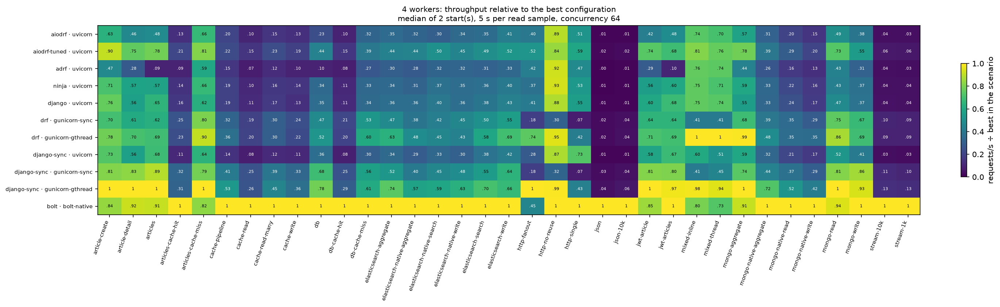

### Fastest configuration per scenario

| Scenario | 1 worker(s) | 4 worker(s) |
| --- | --- | --- |
| [article-create](#article-create) | django-sync · gunicorn-gthread (456) | django-sync · gunicorn-gthread (1,365) |
| [article-detail](#article-detail) | bolt · bolt-native (1,076) | django-sync · gunicorn-gthread (3,580) |
| [articles](#articles) | django-sync · gunicorn-gthread (618) | django-sync · gunicorn-gthread (1,946) |
| [articles-cache-hit](#articles-cache-hit) | bolt · bolt-native (9,372) | bolt · bolt-native (32,392) |
| [articles-cache-miss](#articles-cache-miss) | django-sync · gunicorn-gthread (579) | django-sync · gunicorn-gthread (1,759) |
| [cache-pipeline](#cache-pipeline) | bolt · bolt-native (9,472) | bolt · bolt-native (25,311) |
| [cache-read](#cache-read) | bolt · bolt-native (15,988) | bolt · bolt-native (52,666) |
| [cache-read-many](#cache-read-many) | bolt · bolt-native (9,826) | bolt · bolt-native (31,158) |
| [cache-write](#cache-write) | bolt · bolt-native (13,933) | bolt · bolt-native (37,913) |
| [db](#db) | bolt · bolt-native (3,645) | bolt · bolt-native (10,346) |
| [db-cache-hit](#db-cache-hit) | bolt · bolt-native (13,140) | bolt · bolt-native (49,231) |
| [db-cache-miss](#db-cache-miss) | bolt · bolt-native (2,948) | bolt · bolt-native (9,214) |
| [elasticsearch-aggregate](#elasticsearch-aggregate) | bolt · bolt-native (2,350) | bolt · bolt-native (8,181) |
| [elasticsearch-native-aggregate](#elasticsearch-native-aggregate) | bolt · bolt-native (3,547) | bolt · bolt-native (10,418) |
| [elasticsearch-native-search](#elasticsearch-native-search) | bolt · bolt-native (3,103) | bolt · bolt-native (8,625) |
| [elasticsearch-native-write](#elasticsearch-native-write) | bolt · bolt-native (2,862) | bolt · bolt-native (9,123) |
| [elasticsearch-search](#elasticsearch-search) | bolt · bolt-native (2,059) | bolt · bolt-native (7,133) |
| [elasticsearch-write](#elasticsearch-write) | bolt · bolt-native (1,827) | bolt · bolt-native (6,535) |
| [http-fanout](#http-fanout) | django-sync · gunicorn-gthread (651) | django-sync · gunicorn-gthread (1,653) |
| [http-no-reuse](#http-no-reuse) | bolt · bolt-native (285) | bolt · bolt-native (834) |
| [http-single](#http-single) | django-sync · uvicorn (1,065) | bolt · bolt-native (4,391) |
| [json](#json) | bolt · bolt-native (172,838) | bolt · bolt-native (517,316) |
| [json-10k](#json-10k) | bolt · bolt-native (108,841) | bolt · bolt-native (340,580) |
| [jwt-article](#jwt-article) | django-sync · gunicorn-gthread (763) | django-sync · gunicorn-gthread (2,545) |
| [jwt-articles](#jwt-articles) | bolt · bolt-native (567) | bolt · bolt-native (1,652) |
| [mixed-inline](#mixed-inline) | django-sync · gunicorn-gthread (314) | drf · gunicorn-gthread (640) |
| [mixed-thread](#mixed-thread) | django-sync · gunicorn-gthread (352) | drf · gunicorn-gthread (635) |
| [mongo-aggregate](#mongo-aggregate) | django-sync · gunicorn-gthread (1,394) | django-sync · gunicorn-gthread (4,044) |
| [mongo-native-aggregate](#mongo-native-aggregate) | bolt · bolt-native (5,780) | bolt · bolt-native (12,751) |
| [mongo-native-read](#mongo-native-read) | bolt · bolt-native (5,842) | bolt · bolt-native (18,147) |
| [mongo-native-write](#mongo-native-write) | bolt · bolt-native (7,977) | bolt · bolt-native (27,906) |
| [mongo-read](#mongo-read) | django-sync · gunicorn-gthread (1,784) | django-sync · gunicorn-gthread (5,347) |
| [mongo-write](#mongo-write) | bolt · bolt-native (2,571) | bolt · bolt-native (8,336) |
| [stream-10k](#stream-10k) | bolt · bolt-native (38,419) | bolt · bolt-native (121,647) |
| [stream-1k](#stream-1k) | bolt · bolt-native (44,972) | bolt · bolt-native (138,081) |

## Service headroom

The highest CPU utilization any external service reached in each scenario, over all configurations.

| Scenario | Service | Utilization | Configuration |
| --- | --- | ---: | --- |
| article-create | postgres | 68% | django-sync · gunicorn-gthread · 4w |
| article-detail | postgres | 51% | django-sync · gunicorn-gthread · 4w |
| articles | postgres | 51% | django-sync · gunicorn-gthread · 4w |
| articles-cache-hit | valkey | 57% | bolt · bolt-native · 4w |
| articles-cache-miss | postgres | 48% | django-sync · gunicorn-gthread · 4w |
| cache-pipeline | valkey | 36% | bolt · bolt-native · 4w |
| cache-read | valkey | 66% | bolt · bolt-native · 4w |
| cache-read-many | valkey | 52% | bolt · bolt-native · 4w |
| cache-write | valkey | 32% | bolt · bolt-native · 4w |
| db | postgres | 29% | bolt · bolt-native · 4w |
| db-cache-hit | valkey | 64% | bolt · bolt-native · 4w |
| db-cache-miss | valkey | 30% | bolt · bolt-native · 4w |
| elasticsearch-aggregate | elasticsearch | 56% | bolt · bolt-native · 4w |
| elasticsearch-native-aggregate | elasticsearch | 69% | bolt · bolt-native · 4w |
| elasticsearch-native-search | elasticsearch | 72% | bolt · bolt-native · 4w |
| elasticsearch-native-write | elasticsearch | 38% | bolt · bolt-native · 4w |
| elasticsearch-search | elasticsearch | 62% | bolt · bolt-native · 4w |
| elasticsearch-write | elasticsearch | 33% | bolt · bolt-native · 4w |
| http-fanout | http | 21% | django-sync · gunicorn-gthread · 4w |
| http-no-reuse | http | 10% | django-sync · gunicorn-gthread · 4w |
| http-single | http | 20% | bolt · bolt-native · 4w |
| json | pgbouncer | 2% | drf · gunicorn-sync · 4w |
| json-10k | pgbouncer | 2% | drf · gunicorn-gthread · 4w |
| jwt-article | postgres | 50% | django-sync · gunicorn-gthread · 4w |
| jwt-articles | postgres | 52% | django-sync · gunicorn-gthread · 4w |
| mixed-inline | http | 10% | aiodrf-tuned · uvicorn · 4w |
| mixed-thread | http | 10% | drf · gunicorn-gthread · 4w |
| mongo-aggregate | mongodb | 45% | django-sync · gunicorn-gthread · 4w |
| mongo-native-aggregate | mongodb | 99% | bolt · bolt-native · 4w |
| mongo-native-read | mongodb | 62% | bolt · bolt-native · 4w |
| mongo-native-write | mongodb | 28% | bolt · bolt-native · 4w |
| mongo-read | mongodb | 29% | django-sync · gunicorn-gthread · 4w |
| mongo-write | mongodb | 14% | drf · gunicorn-sync · 4w |
| stream-10k | pgbouncer | 2% | bolt · bolt-native · 4w |
| stream-1k | pgbouncer | 2% | bolt · bolt-native · 4w |

1 group(s) reached 80%.

### Load generator

oha stayed below 80% of its CPUs in every group.

## Scenarios

### article-create

Validate input, insert an article with two tags in a transaction, read it back.

| Framework | Server | 1w req/s | 1w spread | 1w p99 ms | 4w req/s | 4w spread | 4w p99 ms | 4w CPU % | 4w busiest service | 4w load generator |
| --- | --- | ---: | ---: | ---: | ---: | ---: | ---: | ---: | --- | ---: |
| django-sync | gunicorn-gthread | 456 | ±0.9% | 158.8 | 1,365 | ±9.0% | 122.3 | 356 | postgres 68% | 0% |
| aiodrf-tuned | uvicorn | 384 | ±0.5% | 200.6 | 1,239 | ±1.1% | 76.7 | 384 | postgres 65% | 0% |
| bolt | bolt-native | 353 | ±0.2% | 222.8 | 1,148 | ±2.9% | 75.4 | 265 | postgres 48% | 0% |
| django-sync | gunicorn-sync | 337 | ±0.8% | 216.0 | 1,112 | ±0.4% | 72.1 | 260 | postgres 47% | 1% |
| drf | gunicorn-gthread | 367 | ±0.4% | 208.6 | 1,067 | ±0.3% | 133.5 | 362 | postgres 53% | 0% |
| django | uvicorn | 364 | ±1.2% | 209.5 | 1,042 | ±1.7% | 93.5 | 368 | postgres 53% | 0% |
| django-sync | uvicorn | 364 | ±0.6% | 217.9 | 997 | ±2.0% | 107.7 | 343 | postgres 51% | 0% |
| ninja | uvicorn | 352 | ±0.3% | 219.6 | 975 | ±3.7% | 101.5 | 347 | postgres 51% | 0% |
| drf | gunicorn-sync | 289 | ±0.7% | 247.5 | 959 | ±1.0% | 89.1 | 271 | postgres 41% | 1% |
| aiodrf | uvicorn | 294 | ±1.2% | 301.7 | 869 | ±0.1% | 125.8 | 364 | postgres 44% | 0% |
| adrf | uvicorn | 218 | ±0.0% | 436.3 | 644 | ±1.5% | 162.7 | 370 | postgres 32% | 0% |

### article-detail

One article with author and tags.

| Framework | Server | 1w req/s | 1w spread | 1w p99 ms | 4w req/s | 4w spread | 4w p99 ms | 4w CPU % | 4w busiest service | 4w load generator |
| --- | --- | ---: | ---: | ---: | ---: | ---: | ---: | ---: | --- | ---: |
| django-sync | gunicorn-gthread | 1,063 | ±2.5% | 70.5 | 3,580 | ±0.9% | 41.2 | 393 | postgres 51% | 1% |
| bolt | bolt-native | 1,076 | ±1.0% | 66.6 | 3,299 | ±1.0% | 29.2 | 278 | postgres 39% | 1% |
| django-sync | gunicorn-sync | 850 | ±1.8% | 84.7 | 2,976 | ±0.3% | 26.2 | 307 | postgres 37% | 2% |
| aiodrf-tuned | uvicorn | 824 | ±3.3% | 129.9 | 2,700 | ±2.4% | 46.0 | 380 | postgres 40% | 1% |
| drf | gunicorn-gthread | 766 | ±1.0% | 110.7 | 2,534 | ±0.8% | 71.7 | 388 | postgres 37% | 1% |
| drf | gunicorn-sync | 662 | ±1.9% | 110.9 | 2,193 | ±0.6% | 40.5 | 327 | postgres 29% | 1% |
| ninja | uvicorn | 705 | ±1.4% | 136.7 | 2,074 | ±2.0% | 55.7 | 360 | postgres 31% | 0% |
| django | uvicorn | 739 | ±0.7% | 139.8 | 2,027 | ±3.0% | 54.1 | 354 | postgres 31% | 0% |
| django-sync | uvicorn | 748 | ±0.7% | 126.7 | 2,025 | ±5.4% | 60.5 | 351 | postgres 31% | 1% |
| aiodrf | uvicorn | 557 | ±2.2% | 168.3 | 1,668 | ±0.7% | 62.2 | 368 | postgres 25% | 0% |
| adrf | uvicorn | 356 | ±0.9% | 276.8 | 1,013 | ±8.5% | 129.6 | 350 | postgres 17% | 0% |

### articles

Twenty articles with author and tags (join and prefetch) and the total count.

| Framework | Server | 1w req/s | 1w spread | 1w p99 ms | 4w req/s | 4w spread | 4w p99 ms | 4w CPU % | 4w busiest service | 4w load generator |
| --- | --- | ---: | ---: | ---: | ---: | ---: | ---: | ---: | --- | ---: |
| django-sync | gunicorn-gthread | 618 | ±2.8% | 143.4 | 1,946 | ±1.5% | 120.9 | 385 | postgres 51% | 1% |
| bolt | bolt-native | 570 | ±0.3% | 125.6 | 1,774 | ±1.1% | 52.6 | 295 | postgres 39% | 0% |
| django-sync | gunicorn-sync | 502 | ±0.7% | 142.7 | 1,732 | ±0.2% | 44.0 | 300 | postgres 39% | 1% |
| aiodrf-tuned | uvicorn | 483 | ±1.3% | 168.2 | 1,529 | ±1.2% | 82.4 | 390 | postgres 42% | 0% |
| drf | gunicorn-gthread | 415 | ±0.0% | 218.2 | 1,352 | ±1.3% | 163.4 | 376 | postgres 36% | 0% |
| django-sync | uvicorn | 478 | ±4.4% | 185.0 | 1,332 | ±3.9% | 82.8 | 350 | postgres 36% | 0% |
| django | uvicorn | 465 | ±1.7% | 181.0 | 1,267 | ±6.7% | 105.0 | 346 | postgres 35% | 0% |
| drf | gunicorn-sync | 370 | ±2.7% | 202.8 | 1,217 | ±4.4% | 70.2 | 313 | postgres 30% | 1% |
| ninja | uvicorn | 420 | ±3.6% | 199.5 | 1,120 | ±7.8% | 111.1 | 345 | postgres 32% | 0% |
| aiodrf | uvicorn | 324 | ±4.9% | 250.7 | 941 | ±1.6% | 113.9 | 344 | postgres 26% | 0% |
| adrf | uvicorn | 62 | ±1.4% | 1,194.2 | 183 | ±0.6% | 528.5 | 368 | postgres 6% | 0% |

### articles-cache-hit

The articles payload from the cache (no SQL).

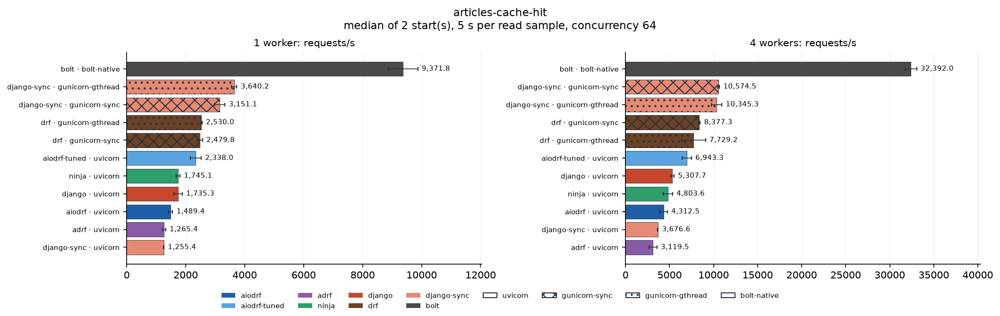

| Framework | Server | 1w req/s | 1w spread | 1w p99 ms | 4w req/s | 4w spread | 4w p99 ms | 4w CPU % | 4w busiest service | 4w load generator |
| --- | --- | ---: | ---: | ---: | ---: | ---: | ---: | ---: | --- | ---: |
| bolt | bolt-native | 9,372 | ±5.3% | 38.5 | 32,392 | ±2.1% | 4.2 | 376 | valkey 57% | 4% |
| django-sync | gunicorn-sync | 3,151 | ±5.7% | 32.2 | 10,575 | ±0.9% | 11.3 | 334 | valkey 23% | 5% |
| django-sync | gunicorn-gthread | 3,640 | ±2.6% | 22.9 | 10,345 | ±5.7% | 22.5 | 371 | valkey 22% | 2% |
| drf | gunicorn-sync | 2,480 | ±3.6% | 46.4 | 8,377 | ±1.1% | 12.9 | 335 | valkey 18% | 4% |
| drf | gunicorn-gthread | 2,530 | ±0.9% | 58.4 | 7,729 | ±17.5% | 28.1 | 352 | valkey 17% | 2% |
| aiodrf-tuned | uvicorn | 2,338 | ±7.9% | 69.4 | 6,943 | ±7.8% | 17.9 | 353 | valkey 13% | 1% |
| django | uvicorn | 1,735 | ±8.3% | 90.2 | 5,308 | ±3.7% | 21.1 | 345 | valkey 10% | 1% |
| ninja | uvicorn | 1,745 | ±3.6% | 87.3 | 4,804 | ±11.1% | 27.0 | 337 | valkey 10% | 1% |
| aiodrf | uvicorn | 1,489 | ±4.4% | 94.2 | 4,313 | ±10.3% | 29.3 | 344 | valkey 9% | 1% |
| django-sync | uvicorn | 1,255 | ±0.5% | 118.2 | 3,677 | ±0.7% | 33.6 | 339 | valkey 9% | 1% |
| adrf | uvicorn | 1,265 | ±4.4% | 160.9 | 3,119 | ±14.3% | 61.5 | 331 | valkey 8% | 1% |

### articles-cache-miss

A cache miss: the articles queries, then a cache write.

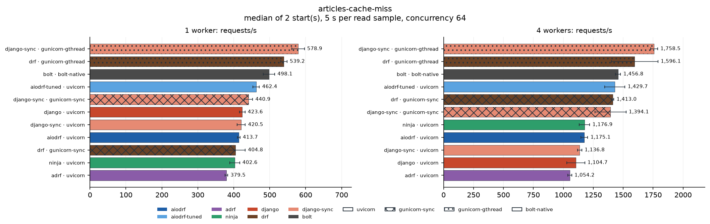

| Framework | Server | 1w req/s | 1w spread | 1w p99 ms | 4w req/s | 4w spread | 4w p99 ms | 4w CPU % | 4w busiest service | 4w load generator |
| --- | --- | ---: | ---: | ---: | ---: | ---: | ---: | ---: | --- | ---: |
| django-sync | gunicorn-gthread | 579 | ±3.0% | 127.2 | 1,759 | ±1.7% | 87.0 | 378 | postgres 48% | 1% |
| drf | gunicorn-gthread | 539 | ±1.7% | 153.7 | 1,596 | ±12.2% | 136.0 | 353 | postgres 41% | 1% |
| bolt | bolt-native | 498 | ±3.2% | 143.5 | 1,457 | ±1.4% | 76.4 | 316 | postgres 34% | 0% |
| aiodrf-tuned | uvicorn | 462 | ±1.9% | 178.3 | 1,430 | ±5.9% | 85.8 | 387 | postgres 40% | 0% |
| drf | gunicorn-sync | 405 | ±6.7% | 201.4 | 1,413 | ±0.6% | 62.2 | 296 | postgres 33% | 1% |
| django-sync | gunicorn-sync | 441 | ±2.6% | 170.0 | 1,394 | ±9.3% | 68.1 | 284 | postgres 33% | 1% |
| ninja | uvicorn | 403 | ±3.4% | 217.6 | 1,177 | ±3.7% | 103.3 | 358 | postgres 32% | 0% |
| aiodrf | uvicorn | 414 | ±0.9% | 202.0 | 1,175 | ±2.4% | 105.0 | 362 | postgres 32% | 0% |
| django-sync | uvicorn | 420 | ±2.8% | 221.8 | 1,137 | ±1.6% | 101.1 | 350 | postgres 31% | 0% |
| django | uvicorn | 424 | ±1.8% | 196.5 | 1,105 | ±6.7% | 110.5 | 349 | postgres 31% | 0% |
| adrf | uvicorn | 380 | ±1.0% | 245.2 | 1,054 | ±1.5% | 131.1 | 360 | postgres 29% | 0% |

### cache-pipeline

Three values written to Valkey in one pipeline.

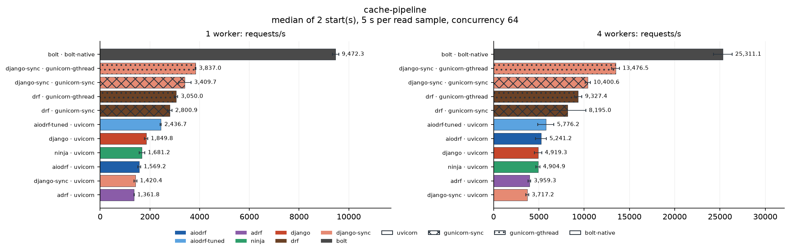

| Framework | Server | 1w req/s | 1w spread | 1w p99 ms | 4w req/s | 4w spread | 4w p99 ms | 4w CPU % | 4w busiest service | 4w load generator |
| --- | --- | ---: | ---: | ---: | ---: | ---: | ---: | ---: | --- | ---: |
| bolt | bolt-native | 9,472 | ±1.3% | 27.9 | 25,311 | ±4.1% | 16.5 | 227 | valkey 36% | 4% |
| django-sync | gunicorn-gthread | 3,837 | ±0.4% | 26.9 | 13,476 | ±3.2% | 20.7 | 212 | valkey 21% | 3% |
| django-sync | gunicorn-sync | 3,410 | ±7.3% | 45.6 | 10,401 | ±2.8% | 16.9 | 245 | valkey 18% | 5% |
| drf | gunicorn-gthread | 3,050 | ±2.4% | 27.7 | 9,327 | ±4.6% | 28.3 | 322 | valkey 17% | 2% |
| drf | gunicorn-sync | 2,801 | ±3.4% | 31.0 | 8,195 | ±24.3% | 14.7 | 267 | valkey 16% | 4% |
| aiodrf-tuned | uvicorn | 2,437 | ±1.0% | 67.6 | 5,776 | ±15.5% | 27.2 | 244 | valkey 12% | 1% |
| aiodrf | uvicorn | 1,569 | ±3.8% | 96.9 | 5,241 | ±11.3% | 21.8 | 319 | valkey 10% | 1% |
| django | uvicorn | 1,850 | ±3.4% | 76.9 | 4,919 | ±8.2% | 26.6 | 301 | valkey 11% | 1% |
| ninja | uvicorn | 1,681 | ±6.6% | 88.0 | 4,905 | ±4.3% | 25.0 | 309 | valkey 10% | 1% |
| adrf | uvicorn | 1,362 | ±0.6% | 118.4 | 3,959 | ±3.8% | 28.2 | 350 | valkey 9% | 1% |
| django-sync | uvicorn | 1,420 | ±4.0% | 107.4 | 3,717 | ±4.3% | 30.9 | 285 | valkey 10% | 1% |

### cache-read

One value from Valkey through Django's cache API.

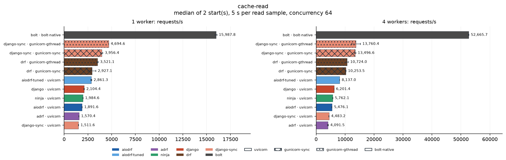

| Framework | Server | 1w req/s | 1w spread | 1w p99 ms | 4w req/s | 4w spread | 4w p99 ms | 4w CPU % | 4w busiest service | 4w load generator |
| --- | --- | ---: | ---: | ---: | ---: | ---: | ---: | ---: | --- | ---: |
| bolt | bolt-native | 15,988 | ±0.6% | 30.4 | 52,666 | ±0.2% | 2.5 | 376 | valkey 66% | 6% |
| django-sync | gunicorn-gthread | 4,695 | ±0.2% | 17.5 | 13,760 | ±11.2% | 11.6 | 372 | valkey 22% | 3% |
| django-sync | gunicorn-sync | 3,956 | ±3.1% | 26.5 | 13,497 | ±1.6% | 8.8 | 311 | valkey 22% | 8% |
| drf | gunicorn-gthread | 3,521 | ±1.6% | 40.6 | 10,724 | ±3.6% | 20.3 | 377 | valkey 17% | 2% |
| drf | gunicorn-sync | 2,927 | ±14.2% | 33.1 | 10,253 | ±0.8% | 11.6 | 316 | valkey 17% | 5% |
| aiodrf-tuned | uvicorn | 2,861 | ±1.6% | 59.8 | 8,137 | ±0.2% | 14.4 | 344 | valkey 11% | 1% |
| django | uvicorn | 2,104 | ±1.2% | 71.4 | 6,201 | ±0.0% | 18.0 | 344 | valkey 9% | 1% |
| ninja | uvicorn | 1,985 | ±0.7% | 80.8 | 5,762 | ±0.5% | 19.8 | 346 | valkey 9% | 1% |
| aiodrf | uvicorn | 1,892 | ±0.7% | 78.5 | 5,476 | ±0.8% | 21.9 | 349 | valkey 8% | 1% |
| django-sync | uvicorn | 1,512 | ±1.0% | 97.8 | 4,483 | ±0.9% | 27.1 | 350 | valkey 8% | 1% |
| adrf | uvicorn | 1,570 | ±0.8% | 105.2 | 4,091 | ±3.5% | 31.6 | 347 | valkey 7% | 1% |

### cache-read-many

Three values from Valkey in one call.

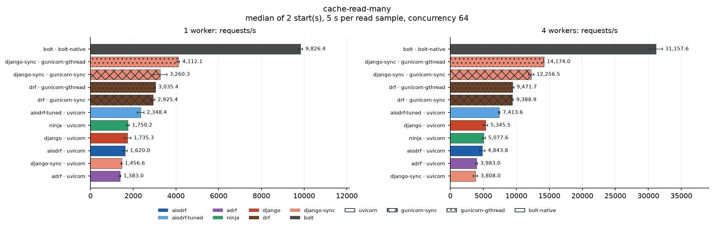

| Framework | Server | 1w req/s | 1w spread | 1w p99 ms | 4w req/s | 4w spread | 4w p99 ms | 4w CPU % | 4w busiest service | 4w load generator |
| --- | --- | ---: | ---: | ---: | ---: | ---: | ---: | ---: | --- | ---: |
| bolt | bolt-native | 9,826 | ±1.1% | 33.9 | 31,158 | ±3.1% | 4.2 | 376 | valkey 52% | 4% |
| django-sync | gunicorn-gthread | 4,112 | ±1.4% | 18.6 | 14,174 | ±0.2% | 14.7 | 390 | valkey 26% | 3% |
| django-sync | gunicorn-sync | 3,260 | ±9.7% | 31.0 | 12,256 | ±3.2% | 10.0 | 322 | valkey 23% | 6% |
| drf | gunicorn-gthread | 3,035 | ±0.3% | 39.8 | 9,472 | ±1.7% | 27.2 | 375 | valkey 18% | 2% |
| drf | gunicorn-sync | 2,925 | ±3.1% | 31.6 | 9,389 | ±2.0% | 12.4 | 324 | valkey 18% | 4% |
| aiodrf-tuned | uvicorn | 2,348 | ±6.6% | 72.9 | 7,414 | ±1.6% | 15.2 | 357 | valkey 13% | 1% |
| django | uvicorn | 1,735 | ±9.2% | 86.6 | 5,346 | ±5.9% | 22.2 | 351 | valkey 9% | 1% |
| ninja | uvicorn | 1,750 | ±3.8% | 82.2 | 5,078 | ±4.9% | 22.6 | 347 | valkey 9% | 1% |
| aiodrf | uvicorn | 1,620 | ±6.1% | 97.7 | 4,844 | ±8.8% | 24.7 | 352 | valkey 9% | 1% |
| adrf | uvicorn | 1,383 | ±2.4% | 124.9 | 3,983 | ±3.6% | 30.9 | 348 | valkey 8% | 1% |
| django-sync | uvicorn | 1,457 | ±1.3% | 103.5 | 3,808 | ±9.0% | 29.5 | 339 | valkey 9% | 1% |

### cache-write

One value written to Valkey.

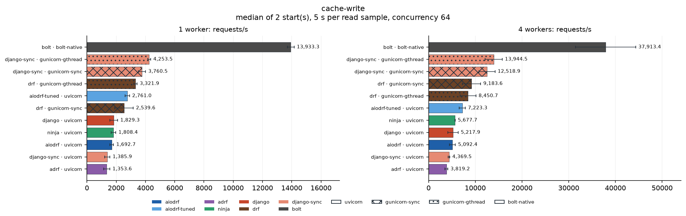

| Framework | Server | 1w req/s | 1w spread | 1w p99 ms | 4w req/s | 4w spread | 4w p99 ms | 4w CPU % | 4w busiest service | 4w load generator |
| --- | --- | ---: | ---: | ---: | ---: | ---: | ---: | ---: | --- | ---: |
| bolt | bolt-native | 13,933 | ±1.6% | 23.6 | 37,913 | ±17.0% | 15.2 | 175 | valkey 32% | 4% |
| django-sync | gunicorn-gthread | 4,253 | ±2.3% | 18.0 | 13,944 | ±13.1% | 15.5 | 205 | valkey 20% | 3% |
| django-sync | gunicorn-sync | 3,760 | ±6.6% | 37.7 | 12,519 | ±13.6% | 16.8 | 213 | valkey 22% | 6% |
| drf | gunicorn-sync | 2,540 | ±24.8% | 39.1 | 9,184 | ±21.3% | 13.8 | 223 | valkey 14% | 5% |
| drf | gunicorn-gthread | 3,322 | ±3.2% | 30.0 | 8,451 | ±19.9% | 33.7 | 279 | valkey 12% | 2% |
| aiodrf-tuned | uvicorn | 2,761 | ±5.4% | 63.8 | 7,223 | ±8.9% | 16.9 | 288 | valkey 9% | 2% |
| ninja | uvicorn | 1,808 | ±9.0% | 94.0 | 5,678 | ±0.3% | 20.9 | 332 | valkey 10% | 1% |
| django | uvicorn | 1,829 | ±14.7% | 92.3 | 5,218 | ±21.4% | 24.9 | 291 | valkey 10% | 1% |
| aiodrf | uvicorn | 1,693 | ±7.6% | 95.3 | 5,092 | ±12.8% | 29.9 | 321 | valkey 7% | 1% |
| django-sync | uvicorn | 1,386 | ±13.3% | 129.4 | 4,369 | ±3.2% | 25.2 | 311 | valkey 8% | 1% |
| adrf | uvicorn | 1,354 | ±15.5% | 133.5 | 3,819 | ±8.0% | 32.0 | 290 | valkey 6% | 1% |

### db

Ten authors from PostgreSQL, ordered.

| Framework | Server | 1w req/s | 1w spread | 1w p99 ms | 4w req/s | 4w spread | 4w p99 ms | 4w CPU % | 4w busiest service | 4w load generator |
| --- | --- | ---: | ---: | ---: | ---: | ---: | ---: | ---: | --- | ---: |
| bolt | bolt-native | 3,645 | ±1.9% | 22.0 | 10,346 | ±3.2% | 9.9 | 311 | postgres 29% | 2% |
| django-sync | gunicorn-gthread | 2,467 | ±2.5% | 31.3 | 8,136 | ±6.0% | 21.5 | 382 | postgres 26% | 2% |
| django-sync | gunicorn-sync | 2,132 | ±4.0% | 38.8 | 7,135 | ±6.8% | 12.0 | 335 | postgres 22% | 4% |
| drf | gunicorn-gthread | 1,684 | ±0.3% | 63.7 | 5,408 | ±4.3% | 39.6 | 385 | postgres 20% | 1% |
| drf | gunicorn-sync | 1,519 | ±2.8% | 48.7 | 4,913 | ±2.5% | 18.7 | 343 | postgres 16% | 3% |
| aiodrf-tuned | uvicorn | 1,617 | ±1.1% | 47.4 | 4,598 | ±6.0% | 24.7 | 370 | postgres 18% | 1% |
| django-sync | uvicorn | 1,319 | ±1.6% | 79.7 | 3,728 | ±4.1% | 30.6 | 353 | postgres 16% | 1% |
| django | uvicorn | 1,365 | ±0.4% | 81.4 | 3,694 | ±3.1% | 30.3 | 359 | postgres 15% | 1% |
| ninja | uvicorn | 1,153 | ±9.6% | 97.6 | 3,528 | ±0.6% | 31.5 | 360 | postgres 14% | 1% |
| aiodrf | uvicorn | 1,014 | ±3.3% | 108.6 | 2,466 | ±5.1% | 47.5 | 327 | postgres 12% | 1% |
| adrf | uvicorn | 376 | ±5.3% | 241.5 | 1,036 | ±0.9% | 95.9 | 362 | postgres 6% | 0% |

### db-cache-hit

The db payload from the cache (no SQL).

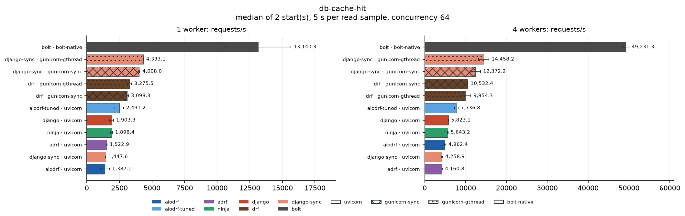

| Framework | Server | 1w req/s | 1w spread | 1w p99 ms | 4w req/s | 4w spread | 4w p99 ms | 4w CPU % | 4w busiest service | 4w load generator |
| --- | --- | ---: | ---: | ---: | ---: | ---: | ---: | ---: | --- | ---: |
| bolt | bolt-native | 13,140 | ±19.2% | 33.1 | 49,231 | ±1.6% | 2.6 | 367 | valkey 64% | 6% |
| django-sync | gunicorn-gthread | 4,333 | ±0.3% | 17.9 | 14,458 | ±8.7% | 17.0 | 367 | valkey 22% | 3% |
| django-sync | gunicorn-sync | 4,008 | ±1.4% | 25.5 | 12,372 | ±10.4% | 10.4 | 316 | valkey 20% | 7% |
| drf | gunicorn-sync | 3,098 | ±2.8% | 30.3 | 10,532 | ±0.4% | 10.4 | 327 | valkey 17% | 5% |
| drf | gunicorn-gthread | 3,276 | ±4.7% | 45.1 | 9,954 | ±13.2% | 18.1 | 356 | valkey 16% | 2% |
| aiodrf-tuned | uvicorn | 2,491 | ±13.2% | 67.2 | 7,737 | ±5.8% | 15.6 | 346 | valkey 12% | 1% |
| django | uvicorn | 1,903 | ±7.5% | 88.8 | 5,823 | ±0.2% | 21.5 | 353 | valkey 9% | 1% |
| ninja | uvicorn | 1,898 | ±3.6% | 86.4 | 5,643 | ±1.1% | 20.8 | 350 | valkey 9% | 1% |
| aiodrf | uvicorn | 1,387 | ±25.1% | 133.5 | 4,962 | ±3.8% | 26.5 | 348 | valkey 8% | 1% |
| django-sync | uvicorn | 1,448 | ±0.3% | 107.6 | 4,259 | ±3.0% | 26.8 | 353 | valkey 8% | 1% |
| adrf | uvicorn | 1,523 | ±1.9% | 111.6 | 4,161 | ±3.7% | 26.6 | 349 | valkey 7% | 1% |

### db-cache-miss

A cache miss: the db query, then a cache write.

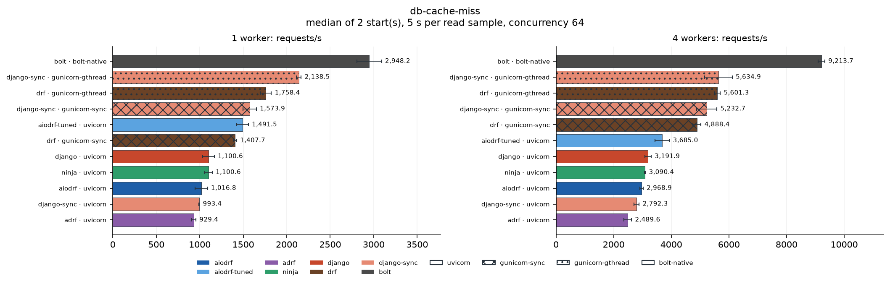

| Framework | Server | 1w req/s | 1w spread | 1w p99 ms | 4w req/s | 4w spread | 4w p99 ms | 4w CPU % | 4w busiest service | 4w load generator |
| --- | --- | ---: | ---: | ---: | ---: | ---: | ---: | ---: | --- | ---: |
| bolt | bolt-native | 2,948 | ±4.8% | 35.1 | 9,214 | ±1.2% | 13.3 | 377 | valkey 30% | 1% |
| django-sync | gunicorn-gthread | 2,138 | ±1.3% | 35.9 | 5,635 | ±8.5% | 32.2 | 369 | valkey 20% | 1% |
| drf | gunicorn-gthread | 1,758 | ±3.7% | 62.0 | 5,601 | ±1.8% | 27.9 | 385 | postgres 21% | 1% |
| django-sync | gunicorn-sync | 1,574 | ±4.9% | 53.7 | 5,233 | ±6.7% | 20.7 | 296 | valkey 19% | 3% |
| drf | gunicorn-sync | 1,408 | ±1.1% | 62.5 | 4,888 | ±2.9% | 20.5 | 306 | valkey 17% | 2% |
| aiodrf-tuned | uvicorn | 1,492 | ±4.5% | 63.6 | 3,685 | ±6.8% | 28.9 | 355 | postgres 16% | 1% |
| django | uvicorn | 1,101 | ±6.1% | 93.4 | 3,192 | ±3.5% | 30.6 | 358 | postgres 13% | 1% |
| ninja | uvicorn | 1,101 | ±3.9% | 95.0 | 3,090 | ±0.4% | 32.8 | 357 | postgres 13% | 1% |
| aiodrf | uvicorn | 1,017 | ±7.1% | 92.0 | 2,969 | ±1.8% | 35.2 | 345 | postgres 13% | 1% |
| django-sync | uvicorn | 993 | ±0.2% | 123.4 | 2,792 | ±3.4% | 45.5 | 353 | postgres 12% | 1% |
| adrf | uvicorn | 929 | ±2.8% | 124.6 | 2,490 | ±5.3% | 42.7 | 350 | postgres 11% | 1% |

### elasticsearch-aggregate

A terms aggregation through django-elasticsearch-dsl.

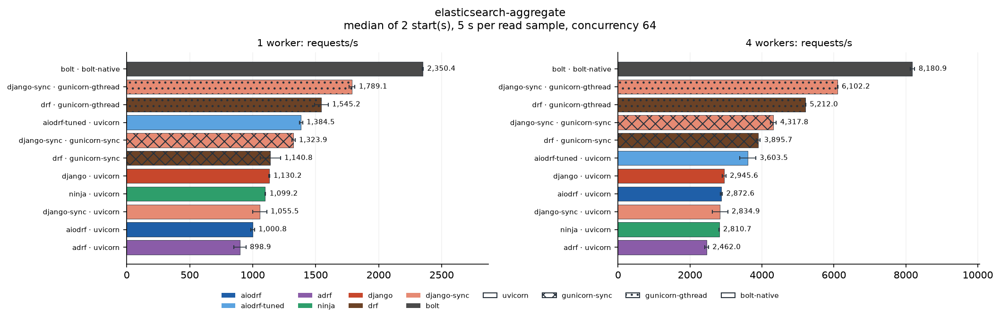

| Framework | Server | 1w req/s | 1w spread | 1w p99 ms | 4w req/s | 4w spread | 4w p99 ms | 4w CPU % | 4w busiest service | 4w load generator |
| --- | --- | ---: | ---: | ---: | ---: | ---: | ---: | ---: | --- | ---: |
| bolt | bolt-native | 2,350 | ±0.2% | 54.8 | 8,181 | ±0.8% | 15.5 | 389 | elasticsearch 56% | 1% |
| django-sync | gunicorn-gthread | 1,789 | ±1.3% | 57.9 | 6,102 | ±0.1% | 29.7 | 390 | elasticsearch 42% | 2% |
| drf | gunicorn-gthread | 1,545 | ±3.5% | 73.0 | 5,212 | ±0.1% | 36.2 | 391 | elasticsearch 37% | 1% |
| django-sync | gunicorn-sync | 1,324 | ±0.9% | 57.3 | 4,318 | ±1.8% | 20.5 | 262 | elasticsearch 31% | 2% |
| drf | gunicorn-sync | 1,141 | ±7.0% | 69.1 | 3,896 | ±1.4% | 25.2 | 257 | elasticsearch 28% | 2% |
| aiodrf-tuned | uvicorn | 1,384 | ±0.9% | 87.4 | 3,603 | ±6.2% | 42.7 | 363 | elasticsearch 29% | 1% |
| django | uvicorn | 1,130 | ±0.3% | 112.2 | 2,946 | ±1.8% | 44.7 | 346 | elasticsearch 23% | 1% |
| aiodrf | uvicorn | 1,001 | ±1.4% | 122.4 | 2,873 | ±0.9% | 42.5 | 353 | elasticsearch 22% | 1% |
| django-sync | uvicorn | 1,055 | ±5.3% | 123.4 | 2,835 | ±7.5% | 49.7 | 335 | elasticsearch 23% | 1% |
| ninja | uvicorn | 1,099 | ±0.3% | 115.9 | 2,811 | ±0.0% | 44.7 | 342 | elasticsearch 23% | 1% |
| adrf | uvicorn | 899 | ±5.3% | 161.1 | 2,462 | ±2.1% | 65.6 | 339 | elasticsearch 20% | 1% |

### elasticsearch-native-aggregate

The same aggregation through the Elasticsearch DSL client.

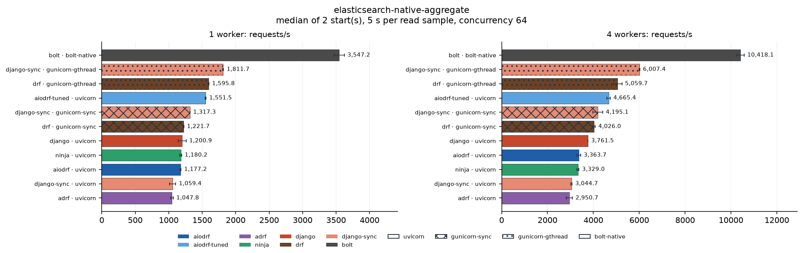

| Framework | Server | 1w req/s | 1w spread | 1w p99 ms | 4w req/s | 4w spread | 4w p99 ms | 4w CPU % | 4w busiest service | 4w load generator |
| --- | --- | ---: | ---: | ---: | ---: | ---: | ---: | ---: | --- | ---: |
| bolt | bolt-native | 3,547 | ±2.1% | 52.1 | 10,418 | ±1.5% | 11.5 | 386 | elasticsearch 69% | 2% |
| django-sync | gunicorn-gthread | 1,812 | ±0.4% | 58.8 | 6,007 | ±0.3% | 27.1 | 383 | elasticsearch 42% | 2% |
| drf | gunicorn-gthread | 1,596 | ±0.3% | 65.7 | 5,060 | ±3.6% | 36.0 | 381 | elasticsearch 36% | 1% |
| aiodrf-tuned | uvicorn | 1,552 | ±0.4% | 91.3 | 4,665 | ±1.5% | 28.4 | 374 | elasticsearch 33% | 1% |
| django-sync | gunicorn-sync | 1,317 | ±0.1% | 57.4 | 4,195 | ±5.0% | 20.6 | 253 | elasticsearch 31% | 2% |
| drf | gunicorn-sync | 1,222 | ±0.3% | 58.4 | 4,026 | ±1.3% | 20.6 | 269 | elasticsearch 29% | 2% |
| django | uvicorn | 1,201 | ±4.9% | 107.9 | 3,762 | ±0.1% | 37.8 | 358 | elasticsearch 27% | 1% |
| aiodrf | uvicorn | 1,177 | ±0.5% | 110.3 | 3,364 | ±2.3% | 54.2 | 356 | elasticsearch 25% | 1% |
| ninja | uvicorn | 1,180 | ±1.0% | 115.6 | 3,329 | ±1.2% | 42.7 | 343 | elasticsearch 25% | 1% |
| django-sync | uvicorn | 1,059 | ±4.3% | 113.1 | 3,045 | ±0.9% | 43.8 | 352 | elasticsearch 24% | 1% |
| adrf | uvicorn | 1,048 | ±1.8% | 131.4 | 2,951 | ±4.6% | 64.3 | 361 | elasticsearch 23% | 1% |

### elasticsearch-native-search

The same search through the Elasticsearch DSL client.

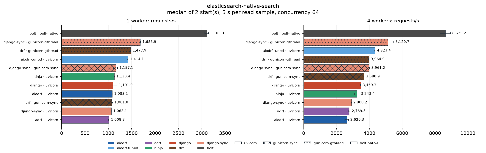

| Framework | Server | 1w req/s | 1w spread | 1w p99 ms | 4w req/s | 4w spread | 4w p99 ms | 4w CPU % | 4w busiest service | 4w load generator |
| --- | --- | ---: | ---: | ---: | ---: | ---: | ---: | ---: | --- | ---: |
| bolt | bolt-native | 3,103 | ±1.3% | 62.4 | 8,625 | ±3.6% | 19.0 | 388 | elasticsearch 72% | 2% |
| django-sync | gunicorn-gthread | 1,684 | ±0.4% | 64.8 | 5,121 | ±7.1% | 40.5 | 374 | elasticsearch 45% | 1% |
| aiodrf-tuned | uvicorn | 1,414 | ±0.8% | 92.6 | 4,323 | ±0.7% | 50.9 | 377 | elasticsearch 37% | 1% |
| drf | gunicorn-gthread | 1,478 | ±0.2% | 73.5 | 3,965 | ±0.4% | 50.4 | 344 | elasticsearch 36% | 1% |
| django-sync | gunicorn-sync | 1,157 | ±3.6% | 69.5 | 3,961 | ±1.2% | 20.6 | 249 | elasticsearch 33% | 2% |
| drf | gunicorn-sync | 1,082 | ±0.9% | 68.6 | 3,681 | ±0.1% | 23.7 | 265 | elasticsearch 31% | 2% |
| django | uvicorn | 1,101 | ±7.7% | 122.4 | 3,469 | ±0.2% | 58.9 | 369 | elasticsearch 31% | 1% |
| ninja | uvicorn | 1,130 | ±0.2% | 123.1 | 3,243 | ±4.1% | 62.8 | 360 | elasticsearch 29% | 1% |
| django-sync | uvicorn | 1,063 | ±0.2% | 117.4 | 2,908 | ±0.1% | 48.8 | 354 | elasticsearch 27% | 1% |
| adrf | uvicorn | 1,008 | ±0.9% | 127.4 | 2,769 | ±1.9% | 69.0 | 364 | elasticsearch 26% | 1% |
| aiodrf | uvicorn | 1,083 | ±0.2% | 123.3 | 2,620 | ±4.1% | 74.3 | 329 | elasticsearch 26% | 1% |

### elasticsearch-native-write

The same write through the Elasticsearch bulk helper.

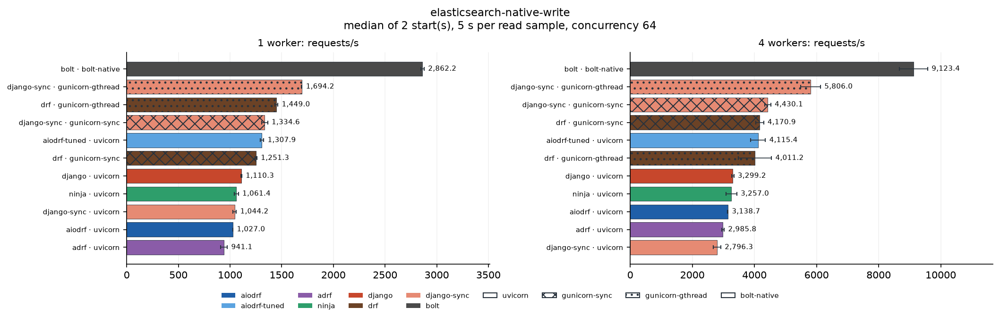

| Framework | Server | 1w req/s | 1w spread | 1w p99 ms | 4w req/s | 4w spread | 4w p99 ms | 4w CPU % | 4w busiest service | 4w load generator |
| --- | --- | ---: | ---: | ---: | ---: | ---: | ---: | ---: | --- | ---: |
| bolt | bolt-native | 2,862 | ±0.6% | 65.6 | 9,123 | ±5.0% | 44.2 | 317 | elasticsearch 38% | 2% |
| django-sync | gunicorn-gthread | 1,694 | ±0.1% | 62.8 | 5,806 | ±5.5% | 32.1 | 333 | elasticsearch 27% | 1% |
| django-sync | gunicorn-sync | 1,335 | ±2.2% | 60.3 | 4,430 | ±2.2% | 21.5 | 262 | elasticsearch 24% | 2% |
| drf | gunicorn-sync | 1,251 | ±0.7% | 60.8 | 4,171 | ±3.0% | 20.5 | 275 | elasticsearch 21% | 2% |
| aiodrf-tuned | uvicorn | 1,308 | ±1.3% | 115.4 | 4,115 | ±5.8% | 43.3 | 347 | elasticsearch 22% | 1% |
| drf | gunicorn-gthread | 1,449 | ±0.9% | 73.3 | 4,011 | ±13.4% | 66.2 | 282 | elasticsearch 23% | 1% |
| django | uvicorn | 1,110 | ±0.3% | 138.7 | 3,299 | ±1.1% | 77.5 | 336 | elasticsearch 19% | 1% |
| ninja | uvicorn | 1,061 | ±1.8% | 142.6 | 3,257 | ±5.4% | 72.4 | 338 | elasticsearch 18% | 1% |
| aiodrf | uvicorn | 1,027 | ±0.1% | 145.1 | 3,139 | ±0.2% | 73.0 | 341 | elasticsearch 18% | 1% |
| adrf | uvicorn | 941 | ±3.4% | 141.0 | 2,986 | ±1.4% | 50.5 | 331 | elasticsearch 17% | 1% |
| django-sync | uvicorn | 1,044 | ±1.6% | 126.4 | 2,796 | ±4.3% | 58.5 | 337 | elasticsearch 17% | 1% |

### elasticsearch-search

A filtered, sorted search through django-elasticsearch-dsl.

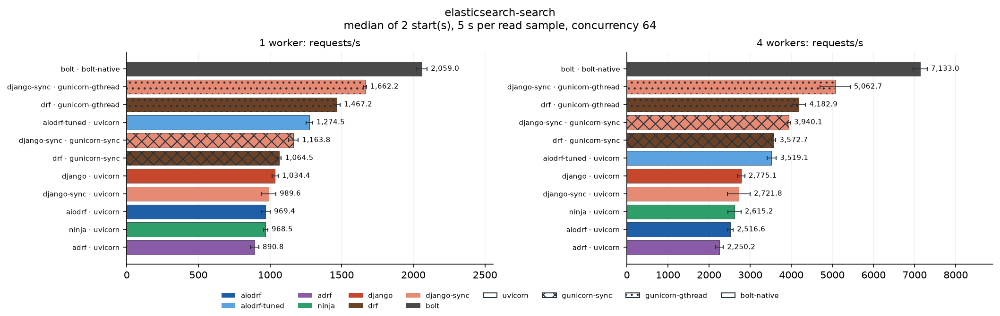

| Framework | Server | 1w req/s | 1w spread | 1w p99 ms | 4w req/s | 4w spread | 4w p99 ms | 4w CPU % | 4w busiest service | 4w load generator |
| --- | --- | ---: | ---: | ---: | ---: | ---: | ---: | ---: | --- | ---: |
| bolt | bolt-native | 2,059 | ±1.7% | 63.3 | 7,133 | ±2.4% | 20.3 | 384 | elasticsearch 62% | 1% |
| django-sync | gunicorn-gthread | 1,662 | ±0.6% | 63.3 | 5,063 | ±7.2% | 44.1 | 379 | elasticsearch 45% | 1% |
| drf | gunicorn-gthread | 1,467 | ±1.4% | 75.6 | 4,183 | ±3.8% | 49.3 | 368 | elasticsearch 39% | 1% |
| django-sync | gunicorn-sync | 1,164 | ±2.8% | 64.6 | 3,940 | ±0.8% | 20.7 | 254 | elasticsearch 33% | 2% |
| drf | gunicorn-sync | 1,064 | ±1.2% | 81.7 | 3,573 | ±1.3% | 24.2 | 262 | elasticsearch 31% | 2% |
| aiodrf-tuned | uvicorn | 1,274 | ±1.8% | 92.6 | 3,519 | ±3.2% | 55.2 | 364 | elasticsearch 33% | 1% |
| django | uvicorn | 1,034 | ±2.1% | 117.1 | 2,775 | ±3.3% | 53.3 | 348 | elasticsearch 26% | 1% |
| django-sync | uvicorn | 990 | ±5.0% | 159.9 | 2,722 | ±10.0% | 54.7 | 344 | elasticsearch 26% | 1% |
| ninja | uvicorn | 968 | ±1.5% | 132.4 | 2,615 | ±6.1% | 59.7 | 344 | elasticsearch 26% | 1% |
| aiodrf | uvicorn | 969 | ±3.2% | 124.5 | 2,517 | ±2.6% | 63.8 | 344 | elasticsearch 25% | 1% |
| adrf | uvicorn | 891 | ±3.3% | 142.0 | 2,250 | ±4.1% | 73.2 | 345 | elasticsearch 22% | 1% |

### elasticsearch-write

One document indexed through django-elasticsearch-dsl.

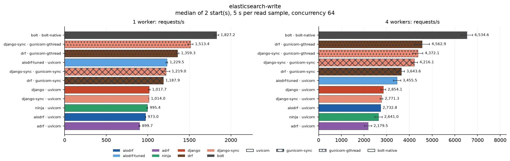

| Framework | Server | 1w req/s | 1w spread | 1w p99 ms | 4w req/s | 4w spread | 4w p99 ms | 4w CPU % | 4w busiest service | 4w load generator |
| --- | --- | ---: | ---: | ---: | ---: | ---: | ---: | ---: | --- | ---: |
| bolt | bolt-native | 1,827 | ±1.4% | 65.6 | 6,535 | ±3.8% | 27.7 | 336 | elasticsearch 33% | 2% |
| drf | gunicorn-gthread | 1,359 | ±1.2% | 76.7 | 4,563 | ±7.2% | 64.8 | 301 | elasticsearch 22% | 1% |
| django-sync | gunicorn-gthread | 1,513 | ±2.1% | 66.6 | 4,372 | ±5.1% | 53.9 | 314 | elasticsearch 25% | 1% |
| django-sync | gunicorn-sync | 1,219 | ±3.8% | 59.7 | 4,216 | ±3.4% | 27.3 | 267 | elasticsearch 23% | 2% |
| drf | gunicorn-sync | 1,188 | ±0.1% | 58.5 | 3,644 | ±3.9% | 23.4 | 263 | elasticsearch 21% | 2% |
| aiodrf-tuned | uvicorn | 1,229 | ±0.9% | 98.1 | 3,456 | ±4.7% | 55.6 | 339 | elasticsearch 20% | 1% |
| django | uvicorn | 1,018 | ±1.0% | 131.0 | 2,854 | ±3.7% | 46.2 | 331 | elasticsearch 17% | 1% |
| django-sync | uvicorn | 1,014 | ±0.0% | 130.4 | 2,771 | ±2.1% | 52.8 | 313 | elasticsearch 17% | 1% |
| aiodrf | uvicorn | 973 | ±0.4% | 142.4 | 2,733 | ±0.1% | 40.2 | 317 | elasticsearch 16% | 1% |
| ninja | uvicorn | 995 | ±0.5% | 133.1 | 2,641 | ±6.1% | 54.0 | 321 | elasticsearch 16% | 1% |
| adrf | uvicorn | 900 | ±0.7% | 126.6 | 2,180 | ±7.1% | 70.0 | 302 | elasticsearch 14% | 1% |

### http-fanout

Three concurrent calls to the HTTP service.

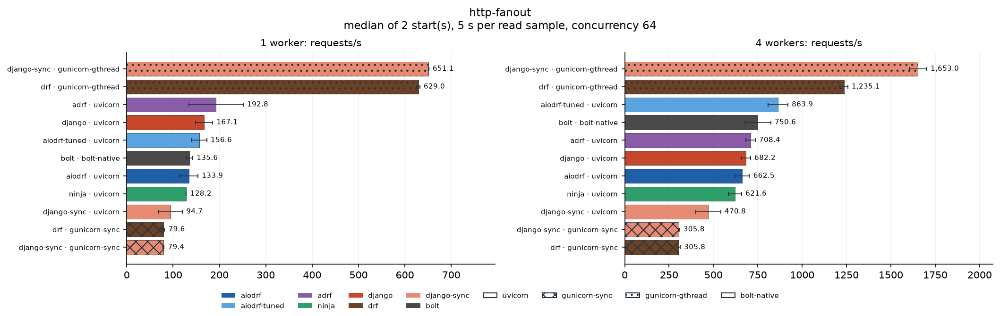

| Framework | Server | 1w req/s | 1w spread | 1w p99 ms | 4w req/s | 4w spread | 4w p99 ms | 4w CPU % | 4w busiest service | 4w load generator |
| --- | --- | ---: | ---: | ---: | ---: | ---: | ---: | ---: | --- | ---: |
| django-sync | gunicorn-gthread | 651 | ±0.1% | 127.9 | 1,653 | ±3.0% | 143.2 | 268 | http 21% | 0% |
| drf | gunicorn-gthread | 629 | ±0.5% | 136.9 | 1,235 | ±1.7% | 133.7 | 210 | http 16% | 0% |
| aiodrf-tuned | uvicorn | 157 | ±10.2% | 1,228.3 | 864 | ±6.4% | 227.5 | 381 | http 14% | 0% |
| bolt | bolt-native | 136 | ±5.0% | 1,341.7 | 751 | ±9.7% | 303.9 | 386 | http 13% | 0% |
| adrf | uvicorn | 193 | ±30.2% | 1,020.6 | 708 | ±3.8% | 253.9 | 365 | http 11% | 0% |
| django | uvicorn | 167 | ±10.9% | 1,154.9 | 682 | ±3.9% | 268.8 | 365 | http 12% | 0% |
| aiodrf | uvicorn | 134 | ±14.7% | 1,503.9 | 662 | ±6.1% | 287.1 | 376 | http 12% | 0% |
| ninja | uvicorn | 128 | ±0.3% | 1,265.0 | 622 | ±5.9% | 351.9 | 356 | http 11% | 0% |
| django-sync | uvicorn | 95 | ±26.7% | 1,608.2 | 471 | ±14.9% | 486.5 | 323 | http 8% | 0% |
| django-sync | gunicorn-sync | 79 | ±1.3% | 851.2 | 306 | ±0.9% | 234.4 | 81 | http 10% | 0% |
| drf | gunicorn-sync | 80 | ±2.5% | 867.8 | 306 | ±2.2% | 246.1 | 78 | http 9% | 0% |

### http-no-reuse

One call to the HTTP service with a new client per request.

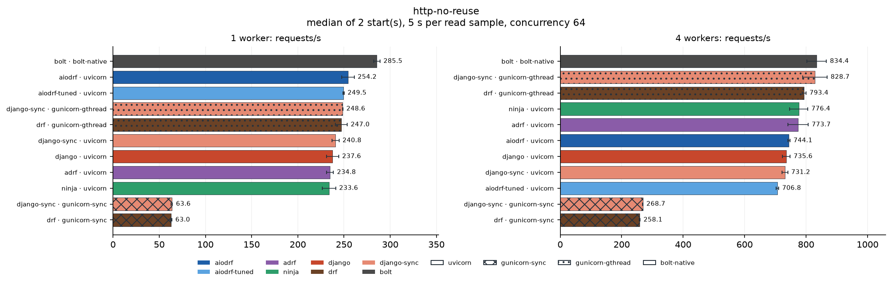

| Framework | Server | 1w req/s | 1w spread | 1w p99 ms | 4w req/s | 4w spread | 4w p99 ms | 4w CPU % | 4w busiest service | 4w load generator |
| --- | --- | ---: | ---: | ---: | ---: | ---: | ---: | ---: | --- | ---: |
| bolt | bolt-native | 285 | ±1.2% | 327.9 | 834 | ±3.8% | 154.4 | 344 | http 8% | 0% |
| django-sync | gunicorn-gthread | 249 | ±0.1% | 312.9 | 829 | ±4.8% | 173.7 | 356 | http 10% | 0% |
| drf | gunicorn-gthread | 247 | ±2.6% | 300.2 | 793 | ±0.8% | 193.4 | 358 | http 10% | 0% |
| ninja | uvicorn | 234 | ±3.1% | 713.9 | 776 | ±3.8% | 112.9 | 367 | http 8% | 0% |
| adrf | uvicorn | 235 | ±1.6% | 556.3 | 774 | ±4.3% | 149.5 | 390 | http 8% | 0% |
| aiodrf | uvicorn | 254 | ±2.7% | 618.3 | 744 | ±0.5% | 135.9 | 339 | http 7% | 0% |
| django | uvicorn | 238 | ±2.8% | 602.9 | 736 | ±1.7% | 130.4 | 352 | http 8% | 0% |
| django-sync | uvicorn | 241 | ±1.6% | 971.2 | 731 | ±1.2% | 139.1 | 370 | http 10% | 0% |
| aiodrf-tuned | uvicorn | 249 | ±0.2% | 551.4 | 707 | ±0.6% | 162.3 | 345 | http 8% | 0% |
| django-sync | gunicorn-sync | 64 | ±1.1% | 1,101.5 | 269 | ±0.1% | 265.7 | 108 | http 4% | 0% |
| drf | gunicorn-sync | 63 | ±1.1% | 1,110.1 | 258 | ±0.6% | 283.3 | 122 | http 4% | 0% |

### http-single

One call to an HTTP service (10 ms), with a reused client.

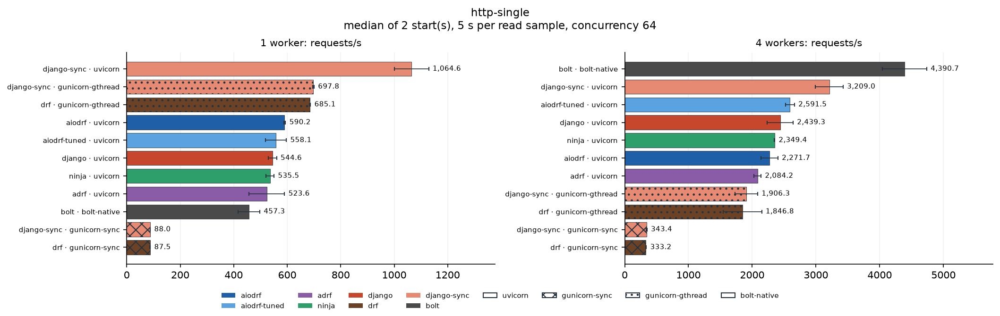

| Framework | Server | 1w req/s | 1w spread | 1w p99 ms | 4w req/s | 4w spread | 4w p99 ms | 4w CPU % | 4w busiest service | 4w load generator |
| --- | --- | ---: | ---: | ---: | ---: | ---: | ---: | ---: | --- | ---: |
| bolt | bolt-native | 457 | ±8.8% | 562.9 | 4,391 | ±7.9% | 32.9 | 279 | http 20% | 1% |
| django-sync | uvicorn | 1,065 | ±6.1% | 109.4 | 3,209 | ±6.8% | 56.3 | 350 | http 15% | 1% |
| aiodrf-tuned | uvicorn | 558 | ±6.9% | 442.4 | 2,592 | ±2.8% | 63.8 | 334 | http 14% | 1% |
| django | uvicorn | 545 | ±2.9% | 495.3 | 2,439 | ±8.3% | 104.3 | 344 | http 12% | 1% |
| ninja | uvicorn | 536 | ±2.8% | 515.0 | 2,349 | ±0.2% | 92.6 | 349 | http 12% | 1% |
| aiodrf | uvicorn | 590 | ±0.6% | 467.0 | 2,272 | ±5.8% | 106.6 | 344 | http 12% | 1% |
| adrf | uvicorn | 524 | ±12.7% | 449.7 | 2,084 | ±2.6% | 78.2 | 357 | http 11% | 1% |
| django-sync | gunicorn-gthread | 698 | ±0.4% | 96.8 | 1,906 | ±9.4% | 76.7 | 127 | http 11% | 1% |
| drf | gunicorn-gthread | 685 | ±0.3% | 113.4 | 1,847 | ±16.4% | 66.3 | 130 | http 10% | 1% |
| django-sync | gunicorn-sync | 88 | ±0.1% | 776.9 | 343 | ±1.8% | 201.0 | 36 | http 4% | 0% |
| drf | gunicorn-sync | 87 | ±0.9% | 756.4 | 333 | ±1.7% | 208.9 | 45 | http 5% | 0% |

### json

A small JSON object, encoded on every request.

| Framework | Server | 1w req/s | 1w spread | 1w p99 ms | 4w req/s | 4w spread | 4w p99 ms | 4w CPU % | 4w busiest service | 4w load generator |
| --- | --- | ---: | ---: | ---: | ---: | ---: | ---: | ---: | --- | ---: |
| bolt | bolt-native | 172,838 | ±3.0% | 0.4 | 517,316 | ±0.9% | 0.2 | 352 | mongodb 2% | 58% |
| django-sync | gunicorn-gthread | 7,707 | ±0.9% | 33.5 | 22,546 | ±4.5% | 17.8 | 375 | valkey 2% | 4% |
| django-sync | gunicorn-sync | 6,946 | ±2.4% | 10.4 | 16,483 | ±0.4% | 12.0 | 282 | pgbouncer 2% | 40% |
| drf | gunicorn-gthread | 5,210 | ±0.3% | 45.0 | 15,366 | ±2.7% | 24.8 | 385 | mongodb 2% | 3% |
| drf | gunicorn-sync | 4,911 | ±3.5% | 15.5 | 14,737 | ±1.1% | 11.0 | 338 | pgbouncer 2% | 16% |
| aiodrf-tuned | uvicorn | 3,054 | ±8.8% | 69.4 | 10,372 | ±2.6% | 12.0 | 351 | pgbouncer 2% | 2% |
| django | uvicorn | 2,089 | ±7.8% | 102.1 | 6,378 | ±7.8% | 30.5 | 340 | valkey 2% | 1% |
| django-sync | uvicorn | 2,304 | ±1.9% | 62.0 | 6,195 | ±2.0% | 17.9 | 347 | valkey 2% | 1% |
| aiodrf | uvicorn | 1,942 | ±0.6% | 98.8 | 6,156 | ±1.4% | 28.5 | 343 | pgbouncer 2% | 1% |
| ninja | uvicorn | 1,973 | ±0.9% | 108.1 | 5,953 | ±2.1% | 29.7 | 348 | mongodb 2% | 1% |
| adrf | uvicorn | 1,808 | ±1.3% | 94.0 | 4,602 | ±4.6% | 28.2 | 345 | pgbouncer 2% | 1% |

### json-10k

A 10 KiB JSON object, encoded on every request.

| Framework | Server | 1w req/s | 1w spread | 1w p99 ms | 4w req/s | 4w spread | 4w p99 ms | 4w CPU % | 4w busiest service | 4w load generator |
| --- | --- | ---: | ---: | ---: | ---: | ---: | ---: | ---: | --- | ---: |
| bolt | bolt-native | 108,841 | ±2.7% | 0.7 | 340,580 | ±1.1% | 0.3 | 362 | pgbouncer 2% | 42% |
| django-sync | gunicorn-gthread | 6,910 | ±0.4% | 36.6 | 22,518 | ±1.1% | 17.7 | 394 | pgbouncer 2% | 4% |
| django-sync | gunicorn-sync | 6,427 | ±0.4% | 12.1 | 15,823 | ±1.5% | 13.9 | 304 | pgbouncer 2% | 29% |
| drf | gunicorn-gthread | 4,820 | ±1.8% | 48.1 | 14,705 | ±1.6% | 30.1 | 393 | pgbouncer 2% | 3% |
| drf | gunicorn-sync | 4,634 | ±1.3% | 15.7 | 14,291 | ±1.0% | 12.0 | 360 | mongodb 2% | 13% |
| aiodrf-tuned | uvicorn | 3,022 | ±7.8% | 69.9 | 10,025 | ±3.3% | 12.5 | 360 | pgbouncer 2% | 2% |
| django-sync | uvicorn | 2,204 | ±3.1% | 64.4 | 6,133 | ±0.2% | 17.8 | 346 | mongodb 2% | 1% |
| aiodrf | uvicorn | 1,910 | ±2.2% | 107.3 | 5,934 | ±2.0% | 30.6 | 361 | pgbouncer 2% | 1% |
| django | uvicorn | 1,901 | ±1.4% | 132.8 | 5,872 | ±1.4% | 33.3 | 345 | pgbouncer 2% | 1% |
| ninja | uvicorn | 2,009 | ±0.5% | 92.9 | 5,832 | ±3.3% | 31.3 | 356 | mongodb 2% | 1% |
| adrf | uvicorn | 1,700 | ±2.9% | 106.9 | 4,461 | ±6.3% | 27.1 | 346 | mongodb 2% | 1% |

### jwt-article

Bearer JWT, the user loaded from PostgreSQL, then one article.

| Framework | Server | 1w req/s | 1w spread | 1w p99 ms | 4w req/s | 4w spread | 4w p99 ms | 4w CPU % | 4w busiest service | 4w load generator |
| --- | --- | ---: | ---: | ---: | ---: | ---: | ---: | ---: | --- | ---: |
| django-sync | gunicorn-gthread | 763 | ±0.9% | 101.1 | 2,545 | ±0.8% | 55.1 | 390 | postgres 50% | 1% |
| bolt | bolt-native | 735 | ±0.3% | 102.4 | 2,175 | ±3.2% | 44.1 | 288 | postgres 35% | 0% |
| django-sync | gunicorn-sync | 618 | ±2.6% | 116.1 | 2,075 | ±6.0% | 41.4 | 305 | postgres 36% | 1% |
| aiodrf-tuned | uvicorn | 579 | ±4.3% | 160.5 | 1,888 | ±0.1% | 61.0 | 388 | postgres 39% | 1% |
| drf | gunicorn-gthread | 556 | ±1.7% | 150.8 | 1,810 | ±1.6% | 79.1 | 377 | postgres 37% | 1% |
| drf | gunicorn-sync | 487 | ±0.4% | 148.5 | 1,652 | ±2.1% | 48.6 | 331 | postgres 29% | 1% |
| django | uvicorn | 549 | ±2.8% | 171.3 | 1,528 | ±6.2% | 70.7 | 351 | postgres 33% | 0% |
| django-sync | uvicorn | 580 | ±0.8% | 150.7 | 1,490 | ±2.4% | 69.0 | 340 | postgres 32% | 0% |
| ninja | uvicorn | 533 | ±4.3% | 178.6 | 1,426 | ±2.0% | 86.0 | 344 | postgres 31% | 0% |
| aiodrf | uvicorn | 397 | ±1.1% | 219.4 | 1,091 | ±7.2% | 96.2 | 346 | postgres 24% | 0% |
| adrf | uvicorn | 279 | ±2.8% | 357.7 | 741 | ±4.8% | 155.1 | 350 | postgres 17% | 0% |

### jwt-articles

Bearer JWT and user, then the second page of twenty articles.

| Framework | Server | 1w req/s | 1w spread | 1w p99 ms | 4w req/s | 4w spread | 4w p99 ms | 4w CPU % | 4w busiest service | 4w load generator |
| --- | --- | ---: | ---: | ---: | ---: | ---: | ---: | ---: | --- | ---: |
| bolt | bolt-native | 567 | ±0.6% | 121.8 | 1,652 | ±4.1% | 55.4 | 298 | postgres 38% | 0% |
| django-sync | gunicorn-gthread | 523 | ±0.7% | 137.2 | 1,617 | ±3.3% | 117.0 | 381 | postgres 52% | 1% |
| django-sync | gunicorn-sync | 411 | ±1.8% | 181.6 | 1,330 | ±0.8% | 65.6 | 303 | postgres 38% | 1% |
| drf | gunicorn-gthread | 362 | ±0.7% | 228.6 | 1,153 | ±0.0% | 188.4 | 388 | postgres 36% | 0% |
| aiodrf-tuned | uvicorn | 374 | ±0.5% | 240.0 | 1,137 | ±6.6% | 108.3 | 389 | postgres 38% | 0% |
| django | uvicorn | 390 | ±2.4% | 210.0 | 1,126 | ±0.7% | 106.1 | 366 | postgres 36% | 0% |
| django-sync | uvicorn | 422 | ±1.4% | 197.7 | 1,123 | ±0.7% | 96.4 | 348 | postgres 36% | 0% |
| drf | gunicorn-sync | 326 | ±0.3% | 227.1 | 1,074 | ±3.8% | 94.9 | 316 | postgres 30% | 1% |
| ninja | uvicorn | 350 | ±1.6% | 241.5 | 992 | ±3.1% | 118.4 | 354 | postgres 32% | 0% |
| aiodrf | uvicorn | 287 | ±1.1% | 290.0 | 806 | ±3.3% | 151.1 | 342 | postgres 27% | 0% |
| adrf | uvicorn | 58 | ±3.4% | 1,291.2 | 172 | ±2.1% | 539.4 | 361 | postgres 7% | 0% |

### mixed-inline

The fanout, then pure-Python CPU work on the request's thread.

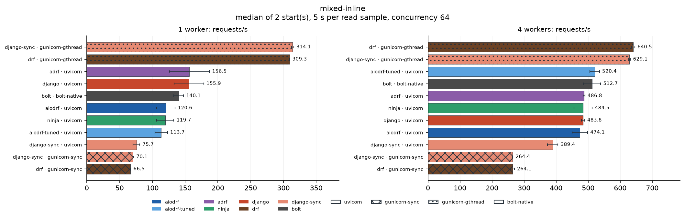

| Framework | Server | 1w req/s | 1w spread | 1w p99 ms | 4w req/s | 4w spread | 4w p99 ms | 4w CPU % | 4w busiest service | 4w load generator |
| --- | --- | ---: | ---: | ---: | ---: | ---: | ---: | ---: | --- | ---: |
| drf | gunicorn-gthread | 309 | ±0.1% | 247.2 | 640 | ±0.8% | 291.4 | 282 | http 10% | 0% |
| django-sync | gunicorn-gthread | 314 | ±0.5% | 233.2 | 629 | ±0.5% | 302.6 | 273 | http 10% | 0% |
| aiodrf-tuned | uvicorn | 114 | ±8.3% | 1,518.1 | 520 | ±2.9% | 374.7 | 381 | http 10% | 0% |
| bolt | bolt-native | 140 | ±5.3% | 1,651.4 | 513 | ±5.1% | 444.3 | 381 | http 10% | 0% |
| adrf | uvicorn | 156 | ±19.6% | 1,275.5 | 487 | ±0.6% | 356.1 | 381 | http 9% | 0% |
| ninja | uvicorn | 120 | ±11.0% | 1,648.5 | 484 | ±5.8% | 386.7 | 365 | http 9% | 0% |
| django | uvicorn | 156 | ±14.5% | 1,262.1 | 484 | ±1.0% | 357.5 | 372 | http 9% | 0% |
| aiodrf | uvicorn | 121 | ±11.7% | 1,570.3 | 474 | ±5.1% | 386.9 | 360 | http 9% | 0% |
| django-sync | uvicorn | 76 | ±6.8% | 1,911.8 | 389 | ±4.2% | 615.3 | 313 | http 7% | 0% |
| django-sync | gunicorn-sync | 70 | ±1.9% | 1,053.2 | 264 | ±0.3% | 281.5 | 109 | http 6% | 0% |
| drf | gunicorn-sync | 67 | ±0.7% | 1,063.9 | 264 | ±2.2% | 285.2 | 108 | http 6% | 0% |

### mixed-thread

The fanout, then the same CPU work in a thread pool.

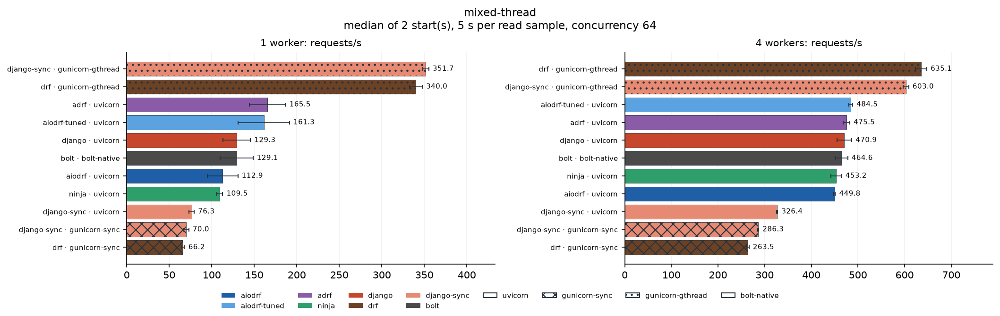

| Framework | Server | 1w req/s | 1w spread | 1w p99 ms | 4w req/s | 4w spread | 4w p99 ms | 4w CPU % | 4w busiest service | 4w load generator |
| --- | --- | ---: | ---: | ---: | ---: | ---: | ---: | ---: | --- | ---: |
| drf | gunicorn-gthread | 340 | ±2.2% | 228.6 | 635 | ±1.9% | 290.3 | 283 | http 10% | 0% |
| django-sync | gunicorn-gthread | 352 | ±1.0% | 204.6 | 603 | ±0.9% | 294.9 | 261 | http 10% | 0% |
| aiodrf-tuned | uvicorn | 161 | ±18.7% | 1,281.4 | 484 | ±0.8% | 400.4 | 333 | http 9% | 0% |
| adrf | uvicorn | 165 | ±12.9% | 1,212.8 | 475 | ±1.4% | 342.6 | 337 | http 8% | 0% |
| django | uvicorn | 129 | ±12.5% | 1,649.9 | 471 | ±3.3% | 369.7 | 343 | http 8% | 0% |
| bolt | bolt-native | 129 | ±15.0% | 1,648.7 | 465 | ±2.9% | 427.2 | 349 | http 9% | 0% |
| ninja | uvicorn | 109 | ±3.0% | 1,636.4 | 453 | ±2.6% | 406.5 | 344 | http 8% | 0% |
| aiodrf | uvicorn | 113 | ±15.8% | 1,608.6 | 450 | ±0.4% | 405.4 | 343 | http 8% | 0% |
| django-sync | uvicorn | 76 | ±4.0% | 2,266.4 | 326 | ±0.3% | 756.7 | 321 | http 6% | 0% |
| django-sync | gunicorn-sync | 70 | ±4.1% | 1,027.1 | 286 | ±0.3% | 264.3 | 94 | http 5% | 0% |
| drf | gunicorn-sync | 66 | ±2.5% | 1,070.9 | 263 | ±1.1% | 284.5 | 111 | http 6% | 0% |

### mongo-aggregate

A group-by aggregation through the Django MongoDB backend.

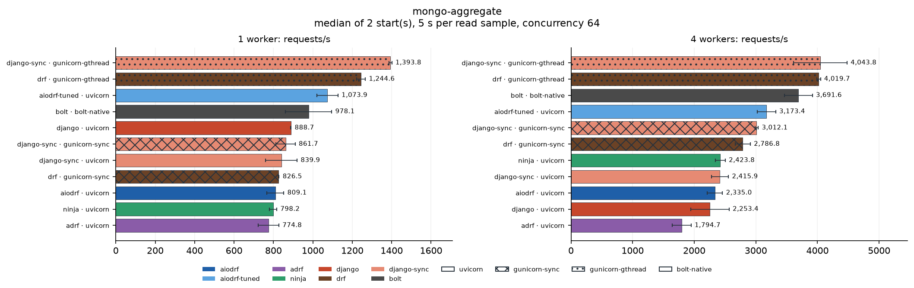

| Framework | Server | 1w req/s | 1w spread | 1w p99 ms | 4w req/s | 4w spread | 4w p99 ms | 4w CPU % | 4w busiest service | 4w load generator |
| --- | --- | ---: | ---: | ---: | ---: | ---: | ---: | ---: | --- | ---: |
| django-sync | gunicorn-gthread | 1,394 | ±0.5% | 55.9 | 4,044 | ±10.8% | 44.2 | 380 | mongodb 45% | 1% |
| drf | gunicorn-gthread | 1,245 | ±1.7% | 78.9 | 4,020 | ±0.7% | 42.1 | 390 | mongodb 43% | 1% |
| bolt | bolt-native | 978 | ±12.0% | 86.1 | 3,692 | ±6.1% | 28.4 | 289 | mongodb 38% | 1% |
| aiodrf-tuned | uvicorn | 1,074 | ±5.0% | 103.4 | 3,173 | ±4.7% | 40.8 | 375 | mongodb 35% | 1% |
| django-sync | gunicorn-sync | 862 | ±5.6% | 92.3 | 3,012 | ±0.9% | 28.6 | 233 | mongodb 30% | 2% |
| drf | gunicorn-sync | 826 | ±0.3% | 100.5 | 2,787 | ±4.4% | 29.7 | 241 | mongodb 28% | 2% |
| ninja | uvicorn | 798 | ±2.3% | 159.2 | 2,424 | ±3.3% | 45.1 | 355 | mongodb 27% | 1% |
| django-sync | uvicorn | 840 | ±9.5% | 151.6 | 2,416 | ±5.8% | 46.5 | 351 | mongodb 27% | 1% |
| aiodrf | uvicorn | 809 | ±5.3% | 173.2 | 2,335 | ±5.3% | 45.9 | 357 | mongodb 26% | 1% |
| django | uvicorn | 889 | ±0.1% | 132.7 | 2,253 | ±13.9% | 53.3 | 333 | mongodb 26% | 1% |
| adrf | uvicorn | 775 | ±6.8% | 165.6 | 1,795 | ±8.5% | 72.2 | 323 | mongodb 22% | 0% |

### mongo-native-aggregate

The same aggregation through PyMongo.

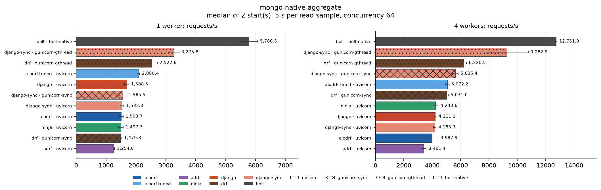

| Framework | Server | 1w req/s | 1w spread | 1w p99 ms | 4w req/s | 4w spread | 4w p99 ms | 4w CPU % | 4w busiest service | 4w load generator |
| --- | --- | ---: | ---: | ---: | ---: | ---: | ---: | ---: | --- | ---: |
| bolt | bolt-native | 5,780 | ±5.0% | 41.6 | 12,751 | ±0.4% | 10.3 | 313 | mongodb 99% ⚠ | 2% |
| django-sync | gunicorn-gthread | 3,276 | ±5.1% | 25.2 | 9,283 | ±16.0% | 22.4 | 374 | mongodb 74% | 2% |
| drf | gunicorn-gthread | 2,523 | ±7.4% | 46.8 | 6,221 | ±3.2% | 28.3 | 331 | mongodb 49% | 2% |
| django-sync | gunicorn-sync | 1,565 | ±6.8% | 63.8 | 5,635 | ±3.5% | 16.4 | 182 | mongodb 41% | 3% |
| aiodrf-tuned | uvicorn | 2,080 | ±2.0% | 70.1 | 5,072 | ±2.3% | 23.6 | 333 | mongodb 44% | 1% |
| drf | gunicorn-sync | 1,480 | ±3.1% | 48.7 | 5,031 | ±2.1% | 18.2 | 202 | mongodb 38% | 2% |
| ninja | uvicorn | 1,498 | ±5.2% | 87.0 | 4,241 | ±4.3% | 30.2 | 354 | mongodb 38% | 1% |
| django | uvicorn | 1,688 | ±4.2% | 74.9 | 4,211 | ±1.7% | 29.8 | 348 | mongodb 40% | 1% |
| django-sync | uvicorn | 1,532 | ±4.2% | 84.5 | 4,185 | ±2.2% | 27.1 | 351 | mongodb 35% | 1% |
| aiodrf | uvicorn | 1,504 | ±4.8% | 86.6 | 3,988 | ±10.9% | 30.0 | 356 | mongodb 37% | 1% |
| adrf | uvicorn | 1,255 | ±2.1% | 123.0 | 3,401 | ±5.3% | 33.8 | 361 | mongodb 31% | 1% |

### mongo-native-read

The same read through PyMongo.

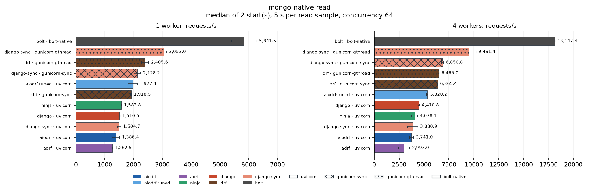

| Framework | Server | 1w req/s | 1w spread | 1w p99 ms | 4w req/s | 4w spread | 4w p99 ms | 4w CPU % | 4w busiest service | 4w load generator |
| --- | --- | ---: | ---: | ---: | ---: | ---: | ---: | ---: | --- | ---: |
| bolt | bolt-native | 5,842 | ±7.5% | 41.1 | 18,147 | ±0.1% | 7.2 | 389 | mongodb 62% | 3% |
| django-sync | gunicorn-gthread | 3,053 | ±3.1% | 25.2 | 9,491 | ±7.9% | 20.9 | 372 | mongodb 33% | 2% |
| django-sync | gunicorn-sync | 2,128 | ±5.7% | 51.4 | 6,851 | ±1.6% | 14.5 | 253 | mongodb 23% | 4% |
| drf | gunicorn-gthread | 2,406 | ±5.0% | 53.4 | 6,465 | ±0.9% | 25.9 | 354 | mongodb 24% | 2% |
| drf | gunicorn-sync | 1,918 | ±0.6% | 42.0 | 6,365 | ±0.1% | 14.5 | 277 | mongodb 21% | 3% |
| aiodrf-tuned | uvicorn | 1,972 | ±7.9% | 70.4 | 5,320 | ±1.2% | 24.6 | 346 | mongodb 22% | 1% |
| django | uvicorn | 1,511 | ±1.4% | 99.0 | 4,471 | ±1.9% | 25.4 | 351 | mongodb 19% | 1% |
| ninja | uvicorn | 1,584 | ±0.3% | 81.2 | 4,038 | ±7.6% | 28.8 | 352 | mongodb 19% | 1% |
| django-sync | uvicorn | 1,505 | ±3.9% | 81.0 | 3,881 | ±13.0% | 29.9 | 344 | mongodb 16% | 1% |
| aiodrf | uvicorn | 1,386 | ±9.5% | 94.3 | 3,741 | ±5.7% | 39.9 | 337 | mongodb 17% | 1% |
| adrf | uvicorn | 1,263 | ±0.4% | 120.2 | 2,993 | ±19.1% | 50.1 | 339 | mongodb 14% | 1% |

### mongo-native-write

The same insert through PyMongo.

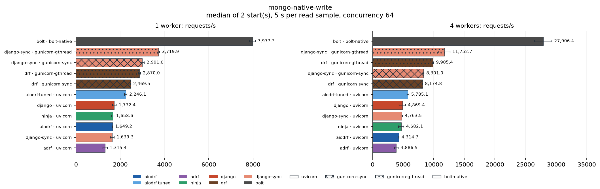

| Framework | Server | 1w req/s | 1w spread | 1w p99 ms | 4w req/s | 4w spread | 4w p99 ms | 4w CPU % | 4w busiest service | 4w load generator |
| --- | --- | ---: | ---: | ---: | ---: | ---: | ---: | ---: | --- | ---: |
| bolt | bolt-native | 7,977 | ±1.7% | 36.2 | 27,906 | ±5.1% | 12.4 | 223 | mongodb 28% | 3% |
| django-sync | gunicorn-gthread | 3,720 | ±1.6% | 25.9 | 11,753 | ±7.8% | 20.3 | 283 | mongodb 16% | 3% |
| drf | gunicorn-gthread | 2,870 | ±1.7% | 49.3 | 9,905 | ±0.8% | 26.3 | 304 | mongodb 13% | 2% |
| django-sync | gunicorn-sync | 2,991 | ±3.1% | 36.3 | 8,301 | ±1.2% | 18.5 | 232 | mongodb 16% | 4% |
| drf | gunicorn-sync | 2,469 | ±0.4% | 31.5 | 8,175 | ±0.1% | 18.1 | 278 | mongodb 13% | 4% |
| aiodrf-tuned | uvicorn | 2,246 | ±2.4% | 61.4 | 5,785 | ±2.6% | 20.9 | 303 | mongodb 10% | 1% |
| django | uvicorn | 1,732 | ±5.1% | 78.6 | 4,869 | ±10.8% | 35.5 | 328 | mongodb 10% | 1% |
| django-sync | uvicorn | 1,639 | ±5.4% | 82.7 | 4,764 | ±2.7% | 22.0 | 274 | mongodb 8% | 1% |
| ninja | uvicorn | 1,659 | ±3.0% | 75.1 | 4,682 | ±9.0% | 35.5 | 325 | mongodb 9% | 1% |
| aiodrf | uvicorn | 1,649 | ±1.0% | 75.7 | 4,315 | ±0.6% | 49.3 | 313 | mongodb 8% | 1% |
| adrf | uvicorn | 1,315 | ±7.4% | 120.3 | 3,886 | ±8.1% | 39.9 | 308 | mongodb 12% | 1% |

### mongo-read

Twenty documents through the Django MongoDB backend (indexed filter).

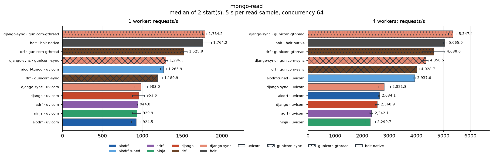

| Framework | Server | 1w req/s | 1w spread | 1w p99 ms | 4w req/s | 4w spread | 4w p99 ms | 4w CPU % | 4w busiest service | 4w load generator |
| --- | --- | ---: | ---: | ---: | ---: | ---: | ---: | ---: | --- | ---: |
| django-sync | gunicorn-gthread | 1,784 | ±1.5% | 43.3 | 5,347 | ±2.9% | 30.9 | 383 | mongodb 29% | 1% |
| bolt | bolt-native | 1,764 | ±5.9% | 49.7 | 5,065 | ±1.3% | 24.6 | 316 | mongodb 27% | 1% |
| drf | gunicorn-gthread | 1,526 | ±2.5% | 70.2 | 4,639 | ±9.0% | 37.3 | 376 | mongodb 26% | 1% |
| django-sync | gunicorn-sync | 1,296 | ±1.9% | 63.1 | 4,356 | ±1.9% | 19.9 | 270 | mongodb 22% | 2% |
| drf | gunicorn-sync | 1,190 | ±5.3% | 65.6 | 4,029 | ±2.0% | 20.4 | 280 | mongodb 20% | 2% |
| aiodrf-tuned | uvicorn | 1,266 | ±2.9% | 105.3 | 3,938 | ±0.7% | 30.3 | 377 | mongodb 22% | 1% |
| django-sync | uvicorn | 983 | ±8.6% | 136.3 | 2,822 | ±8.1% | 41.2 | 345 | mongodb 16% | 1% |
| aiodrf | uvicorn | 925 | ±6.3% | 131.4 | 2,634 | ±0.9% | 45.0 | 347 | mongodb 16% | 1% |
| django | uvicorn | 954 | ±7.9% | 130.4 | 2,561 | ±2.5% | 62.1 | 339 | mongodb 16% | 1% |
| adrf | uvicorn | 944 | ±0.3% | 146.4 | 2,342 | ±2.3% | 48.7 | 348 | mongodb 14% | 1% |
| ninja | uvicorn | 930 | ±5.6% | 133.0 | 2,300 | ±8.2% | 54.1 | 321 | mongodb 15% | 1% |

### mongo-write

One document inserted through the Django MongoDB backend.

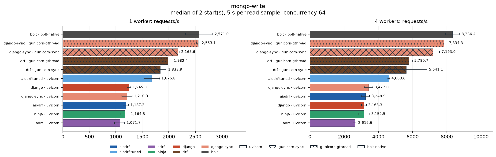

| Framework | Server | 1w req/s | 1w spread | 1w p99 ms | 4w req/s | 4w spread | 4w p99 ms | 4w CPU % | 4w busiest service | 4w load generator |
| --- | --- | ---: | ---: | ---: | ---: | ---: | ---: | ---: | --- | ---: |
| bolt | bolt-native | 2,571 | ±10.0% | 33.2 | 8,336 | ±5.0% | 11.3 | 312 | mongodb 13% | 2% |
| django-sync | gunicorn-gthread | 2,553 | ±1.2% | 31.1 | 7,834 | ±2.3% | 21.4 | 351 | mongodb 13% | 2% |
| django-sync | gunicorn-sync | 2,169 | ±1.3% | 31.9 | 7,193 | ±5.4% | 17.1 | 223 | mongodb 10% | 3% |
| drf | gunicorn-gthread | 1,982 | ±3.8% | 48.5 | 5,781 | ±3.6% | 28.6 | 336 | mongodb 11% | 2% |
| drf | gunicorn-sync | 1,839 | ±6.1% | 45.3 | 5,641 | ±21.4% | 18.0 | 250 | mongodb 14% | 3% |
| aiodrf-tuned | uvicorn | 1,677 | ±8.8% | 100.6 | 4,604 | ±1.2% | 27.3 | 308 | mongodb 9% | 1% |
| django-sync | uvicorn | 1,210 | ±8.0% | 122.6 | 3,427 | ±7.2% | 32.6 | 305 | mongodb 11% | 1% |
| aiodrf | uvicorn | 1,187 | ±4.5% | 123.9 | 3,249 | ±7.5% | 32.9 | 313 | mongodb 10% | 1% |
| django | uvicorn | 1,245 | ±2.9% | 112.6 | 3,163 | ±4.4% | 36.2 | 318 | mongodb 10% | 1% |
| ninja | uvicorn | 1,165 | ±7.2% | 124.5 | 3,153 | ±10.3% | 38.4 | 289 | mongodb 6% | 1% |
| adrf | uvicorn | 1,072 | ±8.8% | 136.9 | 2,617 | ±3.6% | 41.2 | 309 | mongodb 9% | 1% |

### stream-10k

An NDJSON stream of eight lines, 10 KiB in total.

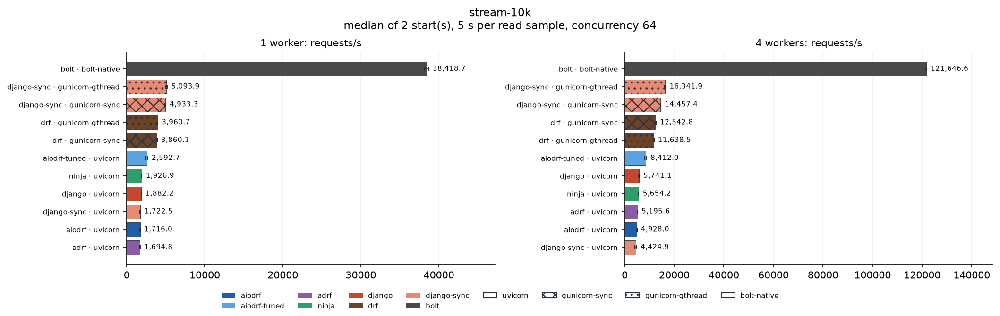

| Framework | Server | 1w req/s | 1w spread | 1w p99 ms | 4w req/s | 4w spread | 4w p99 ms | 4w CPU % | 4w busiest service | 4w load generator |
| --- | --- | ---: | ---: | ---: | ---: | ---: | ---: | ---: | --- | ---: |
| bolt | bolt-native | 38,419 | ±0.7% | 2.6 | 121,647 | ±0.2% | 0.9 | 373 | pgbouncer 2% | 32% |
| django-sync | gunicorn-gthread | 5,094 | ±2.2% | 45.9 | 16,342 | ±1.0% | 25.3 | 385 | pgbouncer 2% | 9% |
| django-sync | gunicorn-sync | 4,933 | ±1.4% | 14.8 | 14,457 | ±0.7% | 11.2 | 359 | postgres 2% | 19% |
| drf | gunicorn-sync | 3,860 | ±0.8% | 19.3 | 12,543 | ±0.9% | 6.3 | 383 | pgbouncer 2% | 10% |
| drf | gunicorn-gthread | 3,961 | ±0.4% | 56.0 | 11,639 | ±1.5% | 30.8 | 386 | valkey 2% | 7% |
| aiodrf-tuned | uvicorn | 2,593 | ±4.1% | 74.6 | 8,412 | ±4.8% | 16.3 | 362 | pgbouncer 2% | 2% |
| django | uvicorn | 1,882 | ±0.8% | 116.8 | 5,741 | ±3.4% | 32.2 | 353 | pgbouncer 2% | 2% |
| ninja | uvicorn | 1,927 | ±1.2% | 103.3 | 5,654 | ±1.0% | 32.3 | 352 | pgbouncer 2% | 2% |
| adrf | uvicorn | 1,695 | ±3.1% | 90.1 | 5,196 | ±0.0% | 23.9 | 366 | pgbouncer 2% | 2% |
| aiodrf | uvicorn | 1,716 | ±0.8% | 106.1 | 4,928 | ±0.8% | 49.5 | 352 | valkey 2% | 2% |
| django-sync | uvicorn | 1,722 | ±3.1% | 85.3 | 4,425 | ±9.7% | 27.9 | 343 | pgbouncer 2% | 2% |

### stream-1k

An NDJSON stream of eight lines, 1 KiB in total.

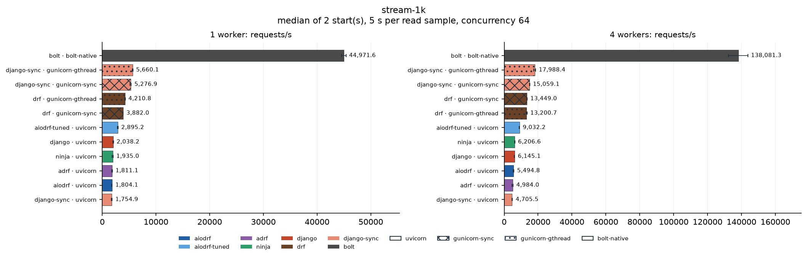

| Framework | Server | 1w req/s | 1w spread | 1w p99 ms | 4w req/s | 4w spread | 4w p99 ms | 4w CPU % | 4w busiest service | 4w load generator |
| --- | --- | ---: | ---: | ---: | ---: | ---: | ---: | ---: | --- | ---: |
| bolt | bolt-native | 44,972 | ±0.9% | 2.3 | 138,081 | ±4.1% | 0.7 | 371 | pgbouncer 2% | 33% |
| django-sync | gunicorn-gthread | 5,660 | ±0.9% | 42.6 | 17,988 | ±3.2% | 23.6 | 393 | pgbouncer 2% | 10% |
| django-sync | gunicorn-sync | 5,277 | ±2.4% | 14.7 | 15,059 | ±0.3% | 11.6 | 335 | pgbouncer 2% | 25% |
| drf | gunicorn-sync | 3,882 | ±0.4% | 23.2 | 13,449 | ±1.0% | 6.6 | 387 | pgbouncer 2% | 10% |
| drf | gunicorn-gthread | 4,211 | ±1.7% | 55.1 | 13,201 | ±2.8% | 31.6 | 383 | mongodb 2% | 8% |
| aiodrf-tuned | uvicorn | 2,895 | ±1.7% | 62.8 | 9,032 | ±0.9% | 15.4 | 355 | mongodb 2% | 2% |
| ninja | uvicorn | 1,935 | ±4.5% | 110.9 | 6,207 | ±1.9% | 26.3 | 350 | valkey 2% | 2% |
| django | uvicorn | 2,038 | ±2.1% | 90.1 | 6,145 | ±1.6% | 28.9 | 353 | valkey 2% | 2% |
| aiodrf | uvicorn | 1,804 | ±2.3% | 102.3 | 5,495 | ±5.3% | 41.2 | 351 | pgbouncer 2% | 1% |
| adrf | uvicorn | 1,811 | ±3.5% | 93.8 | 4,984 | ±7.1% | 23.4 | 353 | mongodb 2% | 1% |
| django-sync | uvicorn | 1,755 | ±4.9% | 85.5 | 4,706 | ±4.5% | 25.1 | 351 | postgres 2% | 2% |

## Corrections

The samples of http-no-reuse, jwt-article come from a later run, `core-full-2026-10-01-supplement` (2026-10-01T10:37:56.633187+00:00 to 2026-10-01T10:51:02.316746+00:00), with the same configurations and parameters; the samples of the first run for these scenarios were removed. In the first run, http-no-reuse exhausted the client's ephemeral ports: the application closed each connection to the HTTP fixture itself, leaving its port in TIME_WAIT, and the fixture requests failed once the range was used up. The requests now ask the fixture to close the connection. Django-Bolt's jwt-article timed out on the PostgreSQL pool: django-bolt 0.11.1 loads the user of `get_current_user` on an executor of up to 32 threads that each keep a pooled connection; the adapter now loads the user with Django's async ORM (docs/frameworks.md).

## Parameters

- Frameworks: aiodrf, aiodrf-tuned, adrf, ninja, drf, django, django-sync, bolt
- Servers: uvicorn, gunicorn-sync, gunicorn-gthread, bolt-native; workers: [1, 4]
- Scenarios: 35
- Server CPUs: [0, 2, 4, 6]; load generator CPUs: [8, 9, 10, 11, 12, 13, 14, 15]
- Repeats: 2; read duration: 5 s; warmup: 2 s
- Concurrency: 64; load threads: 2; requests per write sample: 3000
- Dataset: 1000 articles; profile order seed: 42
- Started: 2026-10-01T07:05:55.048534+00:00; finished: 2026-10-01T10:29:20.760183+00:00
- Load generator: oha 1.16.0

## Environment

- Python: 3.14.7 (main, Sep  1 2026, 14:18:09) [Clang 22.1.3 ]; GIL enabled: True
- Host: Intel(R) Core(TM) i7-14700F, 28 logical CPUs, 123.3 GiB; CPU frequency governor: powersave
- Platform: Linux-7.0.0-31-generic-x86_64-with-glibc2.43
- Packages: Django 6.1.1, django-aiodrf 0.0.1, djangorestframework 3.18.1, adrf 0.1.14, django-ninja 1.7.1, django-bolt 0.11.1, fastapi 0.142.2, litestar 2.24.0, pydantic 2.13.5, msgspec 0.22.0, uvicorn 0.54.0, granian 2.8.4, gunicorn 26.2.0, gevent 26.9.0, uvloop 0.22.1, psycopg 3.3.6
- Source aiodrf: `250a57a7b35b` (commit ae17b9b2278a5ddb91ddf4bac4242ea22d1014ce, working tree clean)
- Source benchmark: `433e44f750c5` (commit ae17b9b2278a5ddb91ddf4bac4242ea22d1014ce, working tree clean)
- PostgreSQL: server_version 18.6 (Debian 18.6-1.pgdg12+2), route direct, shared_buffers 512MB, synchronous_commit off, max_connections 400; application pool {'max_size': 10, 'min_size': 1, 'timeout': 10}

Server commands:

- adrf-uvicorn-w1: `.venv/bin/python -m uvicorn bench.asgi:application --host 127.0.0.1 --port 8100 --workers 1 --loop uvloop --http httptools --ws none --lifespan on --backlog 2048 --timeout-keep-alive 5 --no-access-log --log-level warning`
- adrf-uvicorn-w4: `.venv/bin/python -m uvicorn bench.asgi:application --host 127.0.0.1 --port 8100 --workers 4 --loop uvloop --http httptools --ws none --lifespan on --backlog 2048 --timeout-keep-alive 5 --no-access-log --log-level warning`
- aiodrf-tuned-uvicorn-w1: `.venv/bin/python -m uvicorn bench.asgi:application --host 127.0.0.1 --port 8100 --workers 1 --loop uvloop --http httptools --ws none --lifespan on --backlog 2048 --timeout-keep-alive 5 --no-access-log --log-level warning`
- aiodrf-tuned-uvicorn-w4: `.venv/bin/python -m uvicorn bench.asgi:application --host 127.0.0.1 --port 8100 --workers 4 --loop uvloop --http httptools --ws none --lifespan on --backlog 2048 --timeout-keep-alive 5 --no-access-log --log-level warning`
- aiodrf-uvicorn-w1: `.venv/bin/python -m uvicorn bench.asgi:application --host 127.0.0.1 --port 8100 --workers 1 --loop uvloop --http httptools --ws none --lifespan on --backlog 2048 --timeout-keep-alive 5 --no-access-log --log-level warning`
- aiodrf-uvicorn-w4: `.venv/bin/python -m uvicorn bench.asgi:application --host 127.0.0.1 --port 8100 --workers 4 --loop uvloop --http httptools --ws none --lifespan on --backlog 2048 --timeout-keep-alive 5 --no-access-log --log-level warning`
- bolt-bolt-native-w1: `.venv/bin/python manage.py runbolt --host 127.0.0.1 --port 8100 --processes 1 --no-admin`
- bolt-bolt-native-w4: `.venv/bin/python manage.py runbolt --host 127.0.0.1 --port 8100 --processes 4 --no-admin`
- django-sync-gunicorn-gthread-w1: `.venv/bin/python -m gunicorn bench.wsgi:create_application() --bind 127.0.0.1:8100 --workers 1 --worker-class gthread --threads 8 --worker-connections 256 --backlog 2048 --keep-alive 5 --timeout 60 --graceful-timeout 10 --log-level warning --error-logfile - --config python:bench.gunicorn_config`
- django-sync-gunicorn-gthread-w4: `.venv/bin/python -m gunicorn bench.wsgi:create_application() --bind 127.0.0.1:8100 --workers 4 --worker-class gthread --threads 8 --worker-connections 256 --backlog 2048 --keep-alive 5 --timeout 60 --graceful-timeout 10 --log-level warning --error-logfile - --config python:bench.gunicorn_config`
- django-sync-gunicorn-sync-w1: `.venv/bin/python -m gunicorn bench.wsgi:create_application() --bind 127.0.0.1:8100 --workers 1 --worker-class sync --threads 1 --worker-connections 256 --backlog 2048 --keep-alive 5 --timeout 60 --graceful-timeout 10 --log-level warning --error-logfile - --config python:bench.gunicorn_config`
- django-sync-gunicorn-sync-w4: `.venv/bin/python -m gunicorn bench.wsgi:create_application() --bind 127.0.0.1:8100 --workers 4 --worker-class sync --threads 1 --worker-connections 256 --backlog 2048 --keep-alive 5 --timeout 60 --graceful-timeout 10 --log-level warning --error-logfile - --config python:bench.gunicorn_config`
- django-sync-uvicorn-w1: `.venv/bin/python -m uvicorn bench.asgi:application --host 127.0.0.1 --port 8100 --workers 1 --loop uvloop --http httptools --ws none --lifespan on --backlog 2048 --timeout-keep-alive 5 --no-access-log --log-level warning`
- django-sync-uvicorn-w4: `.venv/bin/python -m uvicorn bench.asgi:application --host 127.0.0.1 --port 8100 --workers 4 --loop uvloop --http httptools --ws none --lifespan on --backlog 2048 --timeout-keep-alive 5 --no-access-log --log-level warning`
- django-uvicorn-w1: `.venv/bin/python -m uvicorn bench.asgi:application --host 127.0.0.1 --port 8100 --workers 1 --loop uvloop --http httptools --ws none --lifespan on --backlog 2048 --timeout-keep-alive 5 --no-access-log --log-level warning`
- django-uvicorn-w4: `.venv/bin/python -m uvicorn bench.asgi:application --host 127.0.0.1 --port 8100 --workers 4 --loop uvloop --http httptools --ws none --lifespan on --backlog 2048 --timeout-keep-alive 5 --no-access-log --log-level warning`
- drf-gunicorn-gthread-w1: `.venv/bin/python -m gunicorn bench.wsgi:create_application() --bind 127.0.0.1:8100 --workers 1 --worker-class gthread --threads 8 --worker-connections 256 --backlog 2048 --keep-alive 5 --timeout 60 --graceful-timeout 10 --log-level warning --error-logfile - --config python:bench.gunicorn_config`
- drf-gunicorn-gthread-w4: `.venv/bin/python -m gunicorn bench.wsgi:create_application() --bind 127.0.0.1:8100 --workers 4 --worker-class gthread --threads 8 --worker-connections 256 --backlog 2048 --keep-alive 5 --timeout 60 --graceful-timeout 10 --log-level warning --error-logfile - --config python:bench.gunicorn_config`
- drf-gunicorn-sync-w1: `.venv/bin/python -m gunicorn bench.wsgi:create_application() --bind 127.0.0.1:8100 --workers 1 --worker-class sync --threads 1 --worker-connections 256 --backlog 2048 --keep-alive 5 --timeout 60 --graceful-timeout 10 --log-level warning --error-logfile - --config python:bench.gunicorn_config`
- drf-gunicorn-sync-w4: `.venv/bin/python -m gunicorn bench.wsgi:create_application() --bind 127.0.0.1:8100 --workers 4 --worker-class sync --threads 1 --worker-connections 256 --backlog 2048 --keep-alive 5 --timeout 60 --graceful-timeout 10 --log-level warning --error-logfile - --config python:bench.gunicorn_config`
- ninja-uvicorn-w1: `.venv/bin/python -m uvicorn bench.asgi:application --host 127.0.0.1 --port 8100 --workers 1 --loop uvloop --http httptools --ws none --lifespan on --backlog 2048 --timeout-keep-alive 5 --no-access-log --log-level warning`
- ninja-uvicorn-w4: `.venv/bin/python -m uvicorn bench.asgi:application --host 127.0.0.1 --port 8100 --workers 4 --loop uvloop --http httptools --ws none --lifespan on --backlog 2048 --timeout-keep-alive 5 --no-access-log --log-level warning`

## Files

`report/summary.csv` holds every group's numbers, `report/samples.json` every
sample and `report/manifest.json` the complete environment of the run,
including the correction run. The charts are in `report/graphs/`. The raw
output of each sample (load generator output, server log, resource samples,
verification) stays in the run directory, which is not part of the repository.
