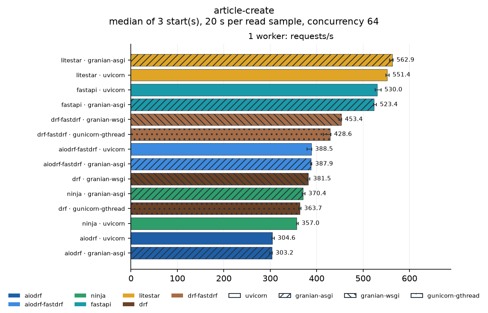
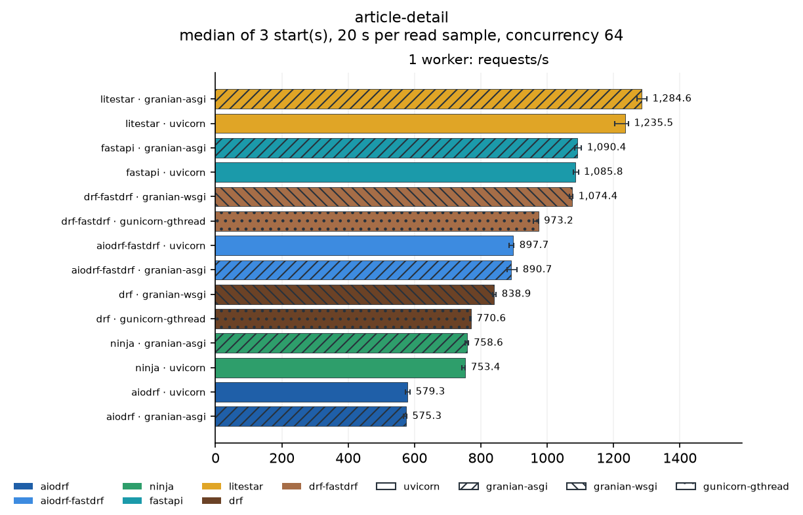
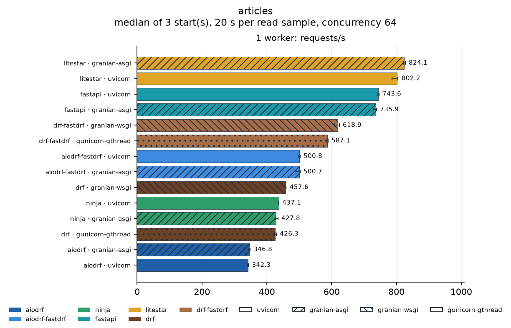
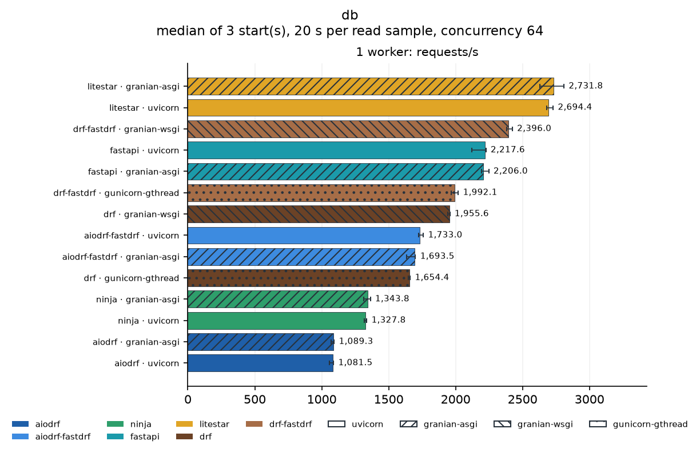
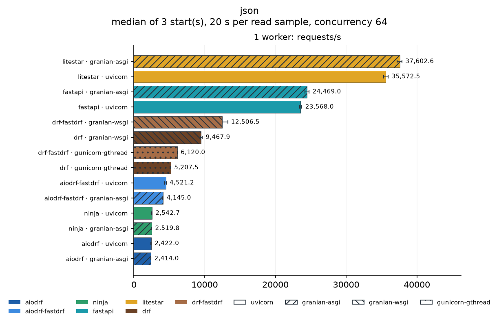
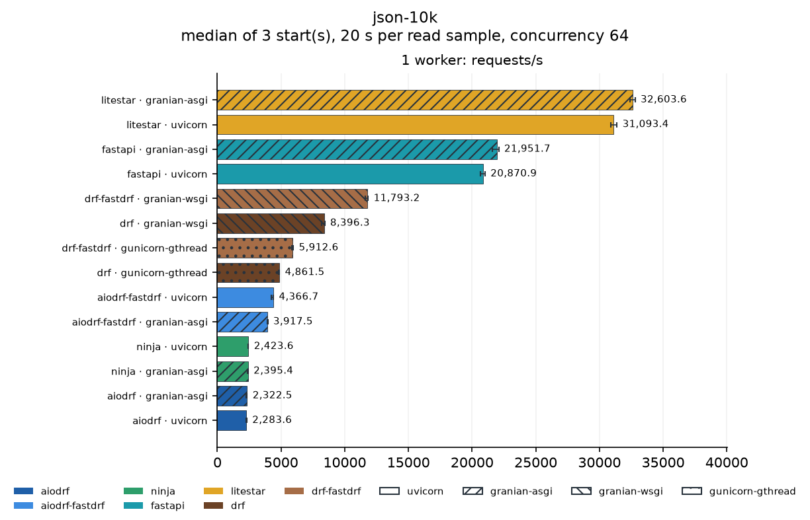
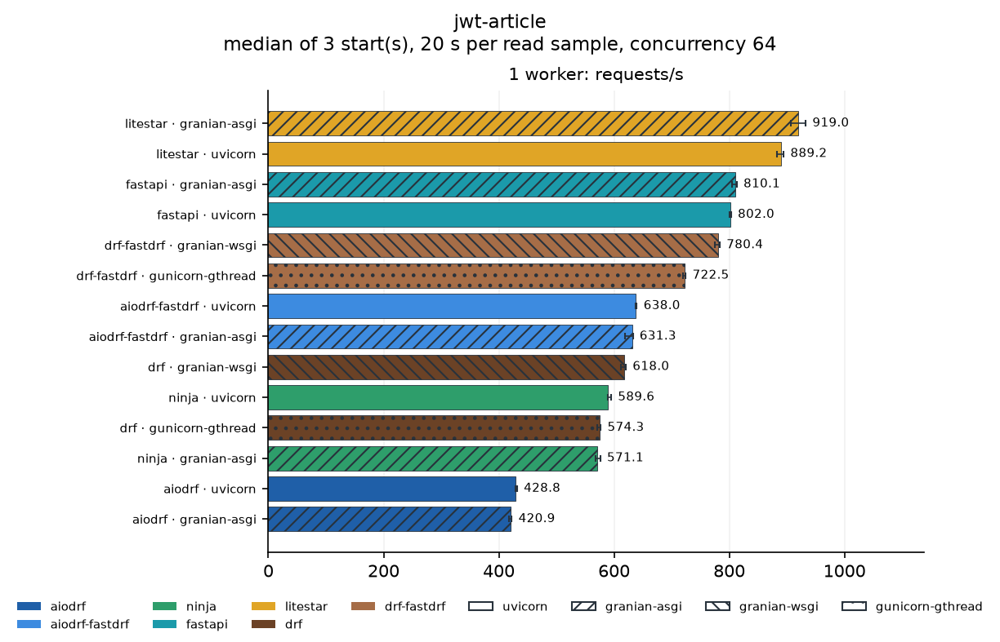
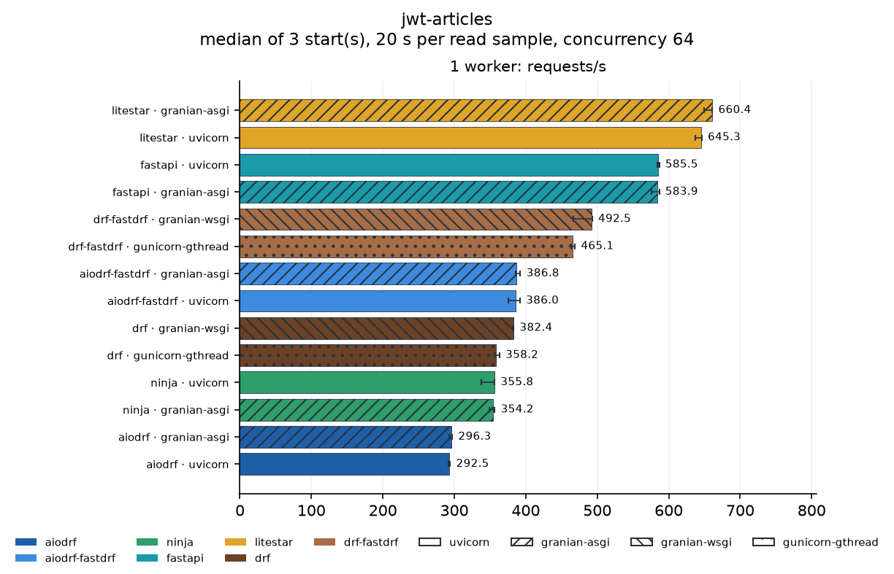

# Benchmark report: comparison-20261004-servers

State: **complete**. 14 server configurations (14 framework/server pairs at 1 worker(s)), 8 scenarios, 3 independent start(s) each: 112 of 112 groups complete.

## Reading this report

- Every number is the median over independent server starts; *spread* is half the min–max range relative to the median.
- Configurations are `framework · server` at a worker count. Worker counts are separate results, never averaged; each worker has one dedicated CPU.
- *Busiest service* is the external service (PostgreSQL, Elasticsearch, MongoDB, Valkey, HTTP fixture) with the highest CPU use during the sample, relative to the CPUs it has. At 80% or more (⚠) the service, not the framework, may have limited throughput.
- CPU % is the server process tree's mean CPU (100 % = one CPU). *Load generator* is oha's CPU use relative to the CPUs it has; at 80% or more (⚠) the load generator may have limited throughput.
- An *invalid* group had a failed verification, an HTTP error or a server error; it is not ranked.

## Overview

Throughput relative to the fastest configuration of each scenario at the same worker count (1 = fastest).

### Fastest configuration per scenario

| Scenario                         | 1 worker(s)                       |
| -------------------------------- | --------------------------------- |
| [article-create](#article-create) | litestar · granian-asgi (563)    |
| [article-detail](#article-detail) | litestar · granian-asgi (1,285)  |
| [articles](#articles)             | litestar · granian-asgi (824)    |
| [db](#db)                         | litestar · granian-asgi (2,732)  |
| [json](#json)                     | litestar · granian-asgi (37,603) |
| [json-10k](#json-10k)             | litestar · granian-asgi (32,604) |
| [jwt-article](#jwt-article)       | litestar · granian-asgi (919)    |
| [jwt-articles](#jwt-articles)     | litestar · granian-asgi (660)    |

## Service headroom

Only PostgreSQL is used by these workloads. CPU diagnostics also include
owned background containers: a PgBouncer entry in a JSON row does not mean
requests used PgBouncer. The database route is direct in every profile.

The highest CPU utilization any external service reached in each scenario, over all configurations.

| Scenario       | Service   | Utilization | Configuration                     |
| -------------- | --------- | ----------: | --------------------------------- |
| article-create | postgres  |         19% | drf-fastdrf · granian-wsgi · 1w |
| article-detail | postgres  |         19% | litestar · granian-asgi · 1w    |
| articles       | postgres  |         22% | litestar · granian-asgi · 1w    |
| db             | postgres  |         14% | litestar · uvicorn · 1w         |
| json           | pgbouncer |          2% | drf · gunicorn-gthread · 1w     |
| json-10k       | pgbouncer |          2% | litestar · uvicorn · 1w         |
| jwt-article    | postgres  |         18% | litestar · granian-asgi · 1w    |
| jwt-articles   | postgres  |         21% | litestar · granian-asgi · 1w    |

No service reached 80% in any group.

### Load generator

oha stayed below 80% of its CPUs in every group.

## Scenarios

### article-create

Validate input, insert an article with two tags in a transaction, read it back.

| Framework      | Server           | 1w req/s | 1w spread | 1w p99 ms | 1w CPU % | 1w busiest service | 1w load generator |
| -------------- | ---------------- | -------: | --------: | --------: | -------: | ------------------ | ----------------: |
| litestar       | granian-asgi     |      563 |    ±0.7% |     172.2 |       99 | postgres 11%       |                0% |
| litestar       | uvicorn          |      551 |    ±0.6% |     160.6 |       98 | postgres 11%       |                0% |
| fastapi        | uvicorn          |      530 |    ±1.2% |     224.5 |       98 | postgres 10%       |                0% |
| fastapi        | granian-asgi     |      523 |    ±0.6% |     172.8 |       99 | postgres 10%       |                0% |
| drf-fastdrf    | granian-wsgi     |      453 |    ±0.7% |     159.5 |       98 | postgres 19%       |                0% |
| drf-fastdrf    | gunicorn-gthread |      429 |    ±1.9% |     175.0 |       99 | postgres 18%       |                0% |
| aiodrf-fastdrf | uvicorn          |      389 |    ±1.4% |     201.6 |       99 | postgres 18%       |                0% |
| aiodrf-fastdrf | granian-asgi     |      388 |    ±0.3% |     199.0 |       97 | postgres 17%       |                0% |
| drf            | granian-wsgi     |      381 |    ±0.6% |     193.4 |       99 | postgres 16%       |                0% |
| ninja          | granian-asgi     |      370 |    ±0.9% |     210.8 |       99 | postgres 17%       |                0% |
| drf            | gunicorn-gthread |      364 |    ±0.6% |     212.7 |       99 | postgres 16%       |                0% |
| ninja          | uvicorn          |      357 |    ±0.5% |     212.1 |       98 | postgres 16%       |                0% |
| aiodrf         | uvicorn          |      305 |    ±0.9% |     283.6 |       98 | postgres 14%       |                0% |
| aiodrf         | granian-asgi     |      303 |    ±1.0% |     272.1 |       99 | postgres 14%       |                0% |

### article-detail

One article with author and tags.

| Framework      | Server           | 1w req/s | 1w spread | 1w p99 ms | 1w CPU % | 1w busiest service | 1w load generator |
| -------------- | ---------------- | -------: | --------: | --------: | -------: | ------------------ | ----------------: |
| litestar       | granian-asgi     |    1,285 |    ±1.2% |      91.9 |       99 | postgres 19%       |                0% |
| litestar       | uvicorn          |    1,235 |    ±1.7% |      95.0 |       99 | postgres 19%       |                0% |
| fastapi        | granian-asgi     |    1,090 |    ±0.9% |     189.5 |       99 | postgres 17%       |                0% |
| fastapi        | uvicorn          |    1,086 |    ±0.7% |     115.6 |       99 | postgres 17%       |                0% |
| drf-fastdrf    | granian-wsgi     |    1,074 |    ±0.5% |      66.0 |       99 | postgres 13%       |                0% |
| drf-fastdrf    | gunicorn-gthread |      973 |    ±0.8% |      78.4 |       99 | postgres 12%       |                0% |
| aiodrf-fastdrf | uvicorn          |      898 |    ±0.8% |     110.6 |       99 | postgres 12%       |                0% |
| aiodrf-fastdrf | granian-asgi     |      891 |    ±1.7% |     105.2 |       99 | postgres 12%       |                0% |
| drf            | granian-wsgi     |      839 |    ±0.7% |     100.8 |       99 | postgres 11%       |                0% |
| drf            | gunicorn-gthread |      771 |    ±0.2% |     113.9 |       99 | postgres 10%       |                0% |
| ninja          | granian-asgi     |      759 |    ±0.6% |     127.5 |       98 | postgres 10%       |                0% |
| ninja          | uvicorn          |      753 |    ±0.7% |     130.8 |       98 | postgres 10%       |                0% |
| aiodrf         | uvicorn          |      579 |    ±1.2% |     157.2 |       99 | postgres 9%        |                0% |
| aiodrf         | granian-asgi     |      575 |    ±0.9% |     154.1 |       99 | postgres 8%        |                0% |

### articles

Twenty articles with author and tags (join and prefetch) and the total count.

| Framework      | Server           | 1w req/s | 1w spread | 1w p99 ms | 1w CPU % | 1w busiest service | 1w load generator |
| -------------- | ---------------- | -------: | --------: | --------: | -------: | ------------------ | ----------------: |
| litestar       | granian-asgi     |      824 |    ±0.3% |     124.7 |       99 | postgres 22%       |                0% |
| litestar       | uvicorn          |      802 |    ±1.2% |     125.1 |       99 | postgres 22%       |                0% |
| fastapi        | uvicorn          |      744 |    ±0.2% |     172.3 |       99 | postgres 21%       |                0% |
| fastapi        | granian-asgi     |      736 |    ±0.7% |     289.6 |       99 | postgres 20%       |                0% |
| drf-fastdrf    | granian-wsgi     |      619 |    ±1.1% |     118.9 |      100 | postgres 14%       |                0% |
| drf-fastdrf    | gunicorn-gthread |      587 |    ±0.3% |     131.5 |       99 | postgres 14%       |                0% |
| aiodrf-fastdrf | uvicorn          |      501 |    ±0.6% |     170.6 |       99 | postgres 12%       |                0% |
| aiodrf-fastdrf | granian-asgi     |      501 |    ±1.3% |     164.3 |       99 | postgres 12%       |                0% |
| drf            | granian-wsgi     |      458 |    ±0.3% |     175.7 |      100 | postgres 11%       |                0% |
| ninja          | uvicorn          |      437 |    ±0.1% |     192.8 |       99 | postgres 11%       |                0% |
| ninja          | granian-asgi     |      428 |    ±0.8% |     189.3 |       99 | postgres 11%       |                0% |
| drf            | gunicorn-gthread |      426 |    ±0.8% |     198.6 |      100 | postgres 10%       |                0% |
| aiodrf         | granian-asgi     |      347 |    ±0.5% |     228.6 |       99 | postgres 9%        |                0% |
| aiodrf         | uvicorn          |      342 |    ±0.7% |     224.8 |       99 | postgres 9%        |                0% |

### db

Ten authors from PostgreSQL, ordered.

| Framework      | Server           | 1w req/s | 1w spread | 1w p99 ms | 1w CPU % | 1w busiest service | 1w load generator |
| -------------- | ---------------- | -------: | --------: | --------: | -------: | ------------------ | ----------------: |
| litestar       | granian-asgi     |    2,732 |    ±3.3% |      64.6 |       99 | postgres 14%       |                1% |
| litestar       | uvicorn          |    2,694 |    ±0.9% |      29.0 |       99 | postgres 14%       |                1% |
| drf-fastdrf    | granian-wsgi     |    2,396 |    ±0.9% |      29.5 |       99 | postgres 7%        |                1% |
| fastapi        | uvicorn          |    2,218 |    ±2.4% |      63.1 |       99 | postgres 12%       |                0% |
| fastapi        | granian-asgi     |    2,206 |    ±1.2% |      88.4 |      100 | postgres 11%       |                0% |
| drf-fastdrf    | gunicorn-gthread |    1,992 |    ±1.4% |      37.8 |       99 | postgres 6%        |                0% |
| drf            | granian-wsgi     |    1,956 |    ±0.4% |      40.6 |       99 | postgres 6%        |                1% |
| aiodrf-fastdrf | uvicorn          |    1,733 |    ±1.1% |      45.1 |       99 | postgres 6%        |                0% |
| aiodrf-fastdrf | granian-asgi     |    1,694 |    ±2.0% |      52.3 |       99 | postgres 6%        |                0% |
| drf            | gunicorn-gthread |    1,654 |    ±0.4% |      63.3 |       99 | postgres 6%        |                0% |
| ninja          | granian-asgi     |    1,344 |    ±1.9% |      80.4 |       98 | postgres 5%        |                0% |
| ninja          | uvicorn          |    1,328 |    ±0.7% |      81.6 |       98 | postgres 5%        |                0% |
| aiodrf         | granian-asgi     |    1,089 |    ±1.0% |      91.6 |       98 | postgres 4%        |                0% |
| aiodrf         | uvicorn          |    1,081 |    ±1.4% |      91.1 |       98 | postgres 4%        |                0% |

### json

A small JSON object, encoded on every request.

| Framework      | Server           | 1w req/s | 1w spread | 1w p99 ms | 1w CPU % | 1w busiest service | 1w load generator |
| -------------- | ---------------- | -------: | --------: | --------: | -------: | ------------------ | ----------------: |
| litestar       | granian-asgi     |   37,603 |    ±1.0% |       2.0 |       99 | pgbouncer 2%       |                4% |
| litestar       | uvicorn          |   35,572 |    ±0.9% |       2.2 |       99 | pgbouncer 2%       |                4% |
| fastapi        | granian-asgi     |   24,469 |    ±1.2% |       3.1 |       99 | pgbouncer 2%       |                3% |
| fastapi        | uvicorn          |   23,568 |    ±0.6% |       3.0 |       99 | pgbouncer 2%       |                2% |
| drf-fastdrf    | granian-wsgi     |   12,506 |    ±3.1% |      11.9 |       99 | mongodb 2%         |                2% |
| drf            | granian-wsgi     |    9,468 |    ±1.3% |      13.0 |       99 | mongodb 2%         |                2% |
| drf-fastdrf    | gunicorn-gthread |    6,120 |    ±0.2% |      40.7 |       99 | pgbouncer 2%       |                1% |
| drf            | gunicorn-gthread |    5,208 |    ±1.0% |      45.3 |       99 | pgbouncer 2%       |                1% |
| aiodrf-fastdrf | uvicorn          |    4,521 |    ±2.2% |      42.2 |       99 | pgbouncer 2%       |                1% |
| aiodrf-fastdrf | granian-asgi     |    4,145 |    ±1.2% |      43.4 |       98 | mongodb 2%         |                1% |
| ninja          | uvicorn          |    2,543 |    ±1.1% |      65.6 |       98 | pgbouncer 2%       |                0% |
| ninja          | granian-asgi     |    2,520 |    ±0.7% |      54.6 |       97 | pgbouncer 2%       |                0% |
| aiodrf         | uvicorn          |    2,422 |    ±1.5% |      65.8 |       98 | mongodb 2%         |                0% |
| aiodrf         | granian-asgi     |    2,414 |    ±0.2% |      55.2 |       98 | pgbouncer 2%       |                0% |

### json-10k

A 10 KiB JSON object, encoded on every request.

| Framework      | Server           | 1w req/s | 1w spread | 1w p99 ms | 1w CPU % | 1w busiest service | 1w load generator |
| -------------- | ---------------- | -------: | --------: | --------: | -------: | ------------------ | ----------------: |
| litestar       | granian-asgi     |   32,604 |    ±0.6% |       2.3 |       99 | mongodb 2%         |                4% |
| litestar       | uvicorn          |   31,093 |    ±0.8% |       2.4 |       99 | pgbouncer 2%       |                4% |
| fastapi        | granian-asgi     |   21,952 |    ±1.1% |       3.3 |       99 | mongodb 2%         |                2% |
| fastapi        | uvicorn          |   20,871 |    ±0.8% |       3.6 |       99 | mongodb 2%         |                3% |
| drf-fastdrf    | granian-wsgi     |   11,793 |    ±0.9% |      11.9 |       99 | pgbouncer 2%       |                2% |
| drf            | granian-wsgi     |    8,396 |    ±1.4% |      15.4 |       99 | pgbouncer 2%       |                2% |
| drf-fastdrf    | gunicorn-gthread |    5,913 |    ±1.2% |      42.3 |       99 | pgbouncer 2%       |                1% |
| drf            | gunicorn-gthread |    4,862 |    ±0.5% |      48.3 |       99 | pgbouncer 2%       |                1% |
| aiodrf-fastdrf | uvicorn          |    4,367 |    ±1.6% |      43.0 |       99 | mongodb 2%         |                1% |
| aiodrf-fastdrf | granian-asgi     |    3,918 |    ±0.5% |      44.7 |       98 | mongodb 2%         |                1% |
| ninja          | uvicorn          |    2,424 |    ±0.9% |      66.3 |       98 | pgbouncer 2%       |                0% |
| ninja          | granian-asgi     |    2,395 |    ±1.2% |      56.7 |       98 | pgbouncer 2%       |                0% |
| aiodrf         | granian-asgi     |    2,322 |    ±1.2% |      55.3 |       98 | pgbouncer 2%       |                0% |
| aiodrf         | uvicorn          |    2,284 |    ±0.6% |      65.9 |       98 | pgbouncer 2%       |                0% |

### jwt-article

Bearer JWT, the user loaded from PostgreSQL, then one article.

| Framework      | Server           | 1w req/s | 1w spread | 1w p99 ms | 1w CPU % | 1w busiest service | 1w load generator |
| -------------- | ---------------- | -------: | --------: | --------: | -------: | ------------------ | ----------------: |
| litestar       | granian-asgi     |      919 |    ±1.4% |     113.5 |       99 | postgres 18%       |                0% |
| litestar       | uvicorn          |      889 |    ±0.6% |     115.8 |       99 | postgres 18%       |                0% |
| fastapi        | granian-asgi     |      810 |    ±0.5% |     213.7 |       99 | postgres 16%       |                0% |
| fastapi        | uvicorn          |      802 |    ±0.2% |     155.2 |       99 | postgres 16%       |                0% |
| drf-fastdrf    | granian-wsgi     |      780 |    ±0.6% |      93.0 |       99 | postgres 13%       |                0% |
| drf-fastdrf    | gunicorn-gthread |      722 |    ±0.3% |     105.9 |       99 | postgres 12%       |                0% |
| aiodrf-fastdrf | uvicorn          |      638 |    ±0.1% |     132.6 |       99 | postgres 11%       |                0% |
| aiodrf-fastdrf | granian-asgi     |      631 |    ±1.0% |     129.2 |       99 | postgres 11%       |                0% |
| drf            | granian-wsgi     |      618 |    ±0.7% |     129.7 |       99 | postgres 10%       |                0% |
| ninja          | uvicorn          |      590 |    ±0.5% |     148.8 |       99 | postgres 11%       |                0% |
| drf            | gunicorn-gthread |      574 |    ±0.5% |     145.5 |       99 | postgres 10%       |                0% |
| ninja          | granian-asgi     |      571 |    ±0.7% |     149.8 |       99 | postgres 10%       |                0% |
| aiodrf         | uvicorn          |      429 |    ±0.3% |     192.1 |       99 | postgres 8%        |                0% |
| aiodrf         | granian-asgi     |      421 |    ±0.6% |     188.1 |       99 | postgres 8%        |                0% |

### jwt-articles

Bearer JWT and user, then the second page of twenty articles.

| Framework      | Server           | 1w req/s | 1w spread | 1w p99 ms | 1w CPU % | 1w busiest service | 1w load generator |
| -------------- | ---------------- | -------: | --------: | --------: | -------: | ------------------ | ----------------: |
| litestar       | granian-asgi     |      660 |    ±0.9% |     145.2 |       99 | postgres 21%       |                0% |
| litestar       | uvicorn          |      645 |    ±0.7% |     148.9 |       99 | postgres 21%       |                0% |
| fastapi        | uvicorn          |      586 |    ±0.2% |     213.6 |       99 | postgres 19%       |                0% |
| fastapi        | granian-asgi     |      584 |    ±0.9% |     406.6 |       99 | postgres 19%       |                0% |
| drf-fastdrf    | granian-wsgi     |      493 |    ±2.7% |     144.1 |      100 | postgres 13%       |                0% |
| drf-fastdrf    | gunicorn-gthread |      465 |    ±0.6% |     160.9 |      100 | postgres 13%       |                0% |
| aiodrf-fastdrf | granian-asgi     |      387 |    ±0.8% |     210.6 |       99 | postgres 12%       |                0% |
| aiodrf-fastdrf | uvicorn          |      386 |    ±2.1% |     207.7 |       99 | postgres 12%       |                0% |
| drf            | granian-wsgi     |      382 |    ±0.2% |     205.1 |      100 | postgres 11%       |                0% |
| drf            | gunicorn-gthread |      358 |    ±1.0% |     237.6 |       99 | postgres 11%       |                0% |
| ninja          | uvicorn          |      356 |    ±2.7% |     227.5 |       99 | postgres 11%       |                0% |
| ninja          | granian-asgi     |      354 |    ±1.1% |     219.7 |       99 | postgres 11%       |                0% |
| aiodrf         | granian-asgi     |      296 |    ±0.7% |     266.7 |       99 | postgres 9%        |                0% |
| aiodrf         | uvicorn          |      292 |    ±0.4% |     270.8 |      100 | postgres 9%        |                0% |

## Parameters

- Frameworks: fastapi, litestar, ninja, drf, drf-fastdrf, aiodrf, aiodrf-fastdrf
- Servers: uvicorn, granian-asgi, gunicorn-gthread, granian-wsgi; workers: [1]
- Scenarios: 8
- Server CPUs: [0]; load generator CPUs: [8, 9, 10, 11, 12, 13, 14, 15]
- Repeats: 3; read duration: 20 s; warmup: 2 s
- Concurrency: 64; load threads: 2; requests per write sample: 3000
- Dataset: 1000 articles; profile order seed: 42
- Started: 2026-10-03T23:31:56.240287+00:00; finished: 2026-10-04T01:38:52.155626+00:00
- Load generator: oha 1.16.0

## Environment

- Python: 3.14.7 (main, Sep  1 2026, 14:18:09) [Clang 22.1.3 ]; GIL enabled: True
- Host: Intel(R) Core(TM) i7-14700F, 28 logical CPUs, 123.3 GiB; CPU frequency governor: powersave
- Platform: Linux-7.0.0-31-generic-x86_64-with-glibc2.43
- Packages: Django 6.1.1, django-aiodrf 0.0.4, django-fastdrf 0.5.0, aiodrf-asgi-lifespan 0.1.1, djangorestframework 3.18.1, adrf 0.1.14, django-ninja 1.7.1, django-bolt 0.11.1, fastapi 0.142.2, litestar 2.24.0, pydantic 2.13.5, msgspec 0.22.0, uvicorn 0.54.0, granian 2.8.4, gunicorn 26.2.0, gevent 26.9.0, uvloop 0.22.1, psycopg 3.3.6
- Source aiodrf: `f6a72037c3ad` (commit a159adbd83fa3cd259b470483552854a3b5ea211, working tree clean)
- Source benchmark: `0ba778f582ca` (commit a159adbd83fa3cd259b470483552854a3b5ea211, working tree modified)
- Source fastdrf: `63f32eee6b29` (commit a159adbd83fa3cd259b470483552854a3b5ea211, working tree clean)

## Profile configuration

| Profile        | ORM                        | Serializer backend | AIODRF options                                               |
| -------------- | -------------------------- | ------------------ | ------------------------------------------------------------ |
| aiodrf         | Django ORM (psycopg)       | drf                | `{}`                                                       |
| aiodrf-fastdrf | Django ORM (psycopg)       | msgspec            | `{"REPRESENTATION_MODE": "inline", "REQUEST_THREADS": 32}` |
| drf            | Django ORM (psycopg)       | drf                | `{}`                                                       |
| drf-fastdrf    | Django ORM (psycopg)       | msgspec            | `{}`                                                       |
| fastapi        | SQLAlchemy async (psycopg) | Pydantic           | `{}`                                                       |
| litestar       | SQLAlchemy async (psycopg) | msgspec Struct     | `{}`                                                       |
| ninja          | Django ORM (psycopg)       | Pydantic           | `{}`                                                       |

Full parser, renderer and fastdrf settings are in `manifest.json`. SQLAlchemy uses a request-scoped AsyncSession and a worker-scoped async pool; Django uses its psycopg pool. SQL text and transaction management differ between ORMs.

- PostgreSQL: server_version 18.6 (Debian 18.6-1.pgdg12+2), route direct, shared_buffers 512MB, synchronous_commit off, max_connections 400; application pool {'max_size': 10, 'min_size': 1, 'timeout': 10}

Server commands:

- aiodrf-fastdrf-granian-asgi-w1: `/home/ctolon/aiodrf/forks/aiodrf-benchmarks/.venv/bin/python -m granian --interface asgi --host 127.0.0.1 --port 8100 --workers 1 --loop uvloop --http 1 --no-ws --http1-keep-alive --no-http1-pipeline-flush --no-access-log --log-level warning bench.asgi:application`
- aiodrf-fastdrf-uvicorn-w1: `/home/ctolon/aiodrf/forks/aiodrf-benchmarks/.venv/bin/python -m uvicorn bench.asgi:application --host 127.0.0.1 --port 8100 --workers 1 --loop uvloop --http httptools --ws none --lifespan on --backlog 2048 --timeout-keep-alive 5 --no-access-log --log-level warning`
- aiodrf-granian-asgi-w1: `/home/ctolon/aiodrf/forks/aiodrf-benchmarks/.venv/bin/python -m granian --interface asgi --host 127.0.0.1 --port 8100 --workers 1 --loop uvloop --http 1 --no-ws --http1-keep-alive --no-http1-pipeline-flush --no-access-log --log-level warning bench.asgi:application`
- aiodrf-uvicorn-w1: `/home/ctolon/aiodrf/forks/aiodrf-benchmarks/.venv/bin/python -m uvicorn bench.asgi:application --host 127.0.0.1 --port 8100 --workers 1 --loop uvloop --http httptools --ws none --lifespan on --backlog 2048 --timeout-keep-alive 5 --no-access-log --log-level warning`
- drf-fastdrf-granian-wsgi-w1: `/home/ctolon/aiodrf/forks/aiodrf-benchmarks/.venv/bin/python -m granian --interface wsgi --host 127.0.0.1 --port 8100 --workers 1 --loop uvloop --http 1 --no-ws --http1-keep-alive --no-http1-pipeline-flush --no-access-log --log-level warning --runtime-mode mt --runtime-threads 1 --blocking-threads 4 --backpressure 128 --backlog 128 --factory bench.wsgi:create_application`
- drf-fastdrf-gunicorn-gthread-w1: `/home/ctolon/aiodrf/forks/aiodrf-benchmarks/.venv/bin/python -m gunicorn bench.wsgi:create_application() --bind 127.0.0.1:8100 --workers 1 --worker-class gthread --threads 8 --worker-connections 256 --backlog 2048 --keep-alive 5 --timeout 60 --graceful-timeout 10 --log-level warning --error-logfile - --config python:bench.gunicorn_config`
- drf-granian-wsgi-w1: `/home/ctolon/aiodrf/forks/aiodrf-benchmarks/.venv/bin/python -m granian --interface wsgi --host 127.0.0.1 --port 8100 --workers 1 --loop uvloop --http 1 --no-ws --http1-keep-alive --no-http1-pipeline-flush --no-access-log --log-level warning --runtime-mode mt --runtime-threads 1 --blocking-threads 4 --backpressure 128 --backlog 128 --factory bench.wsgi:create_application`
- drf-gunicorn-gthread-w1: `/home/ctolon/aiodrf/forks/aiodrf-benchmarks/.venv/bin/python -m gunicorn bench.wsgi:create_application() --bind 127.0.0.1:8100 --workers 1 --worker-class gthread --threads 8 --worker-connections 256 --backlog 2048 --keep-alive 5 --timeout 60 --graceful-timeout 10 --log-level warning --error-logfile - --config python:bench.gunicorn_config`
- fastapi-granian-asgi-w1: `/home/ctolon/aiodrf/forks/aiodrf-benchmarks/.venv/bin/python -m granian --interface asgi --host 127.0.0.1 --port 8100 --workers 1 --loop uvloop --http 1 --no-ws --http1-keep-alive --no-http1-pipeline-flush --no-access-log --log-level warning bench.asgi:application`
- fastapi-uvicorn-w1: `/home/ctolon/aiodrf/forks/aiodrf-benchmarks/.venv/bin/python -m uvicorn bench.asgi:application --host 127.0.0.1 --port 8100 --workers 1 --loop uvloop --http httptools --ws none --lifespan on --backlog 2048 --timeout-keep-alive 5 --no-access-log --log-level warning`
- litestar-granian-asgi-w1: `/home/ctolon/aiodrf/forks/aiodrf-benchmarks/.venv/bin/python -m granian --interface asgi --host 127.0.0.1 --port 8100 --workers 1 --loop uvloop --http 1 --no-ws --http1-keep-alive --no-http1-pipeline-flush --no-access-log --log-level warning bench.asgi:application`
- litestar-uvicorn-w1: `/home/ctolon/aiodrf/forks/aiodrf-benchmarks/.venv/bin/python -m uvicorn bench.asgi:application --host 127.0.0.1 --port 8100 --workers 1 --loop uvloop --http httptools --ws none --lifespan on --backlog 2048 --timeout-keep-alive 5 --no-access-log --log-level warning`
- ninja-granian-asgi-w1: `/home/ctolon/aiodrf/forks/aiodrf-benchmarks/.venv/bin/python -m granian --interface asgi --host 127.0.0.1 --port 8100 --workers 1 --loop uvloop --http 1 --no-ws --http1-keep-alive --no-http1-pipeline-flush --no-access-log --log-level warning bench.asgi:application`
- ninja-uvicorn-w1: `/home/ctolon/aiodrf/forks/aiodrf-benchmarks/.venv/bin/python -m uvicorn bench.asgi:application --host 127.0.0.1 --port 8100 --workers 1 --loop uvloop --http httptools --ws none --lifespan on --backlog 2048 --timeout-keep-alive 5 --no-access-log --log-level warning`

## Files

`summary.csv` holds every group's numbers; `samples.json` every sample; each case directory the load generator output, server log, resource samples and verification record; `manifest.json` the complete environment.

Published raw case files: [raw-samples.tar.gz](report/raw-samples.tar.gz). Per-sample p99.9 and maximum response times: [tail-latency.csv](report/tail-latency.csv).
