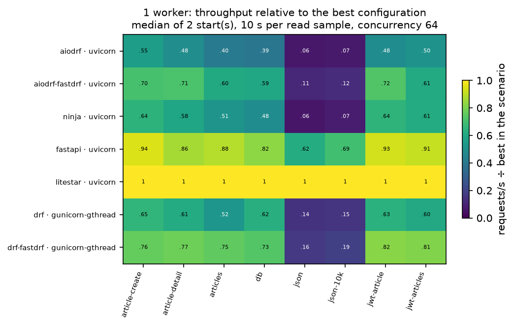
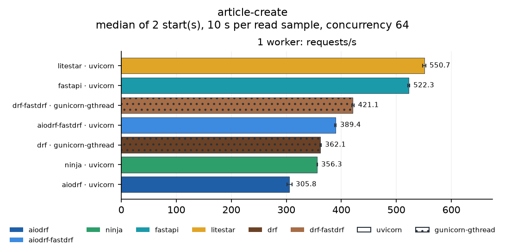
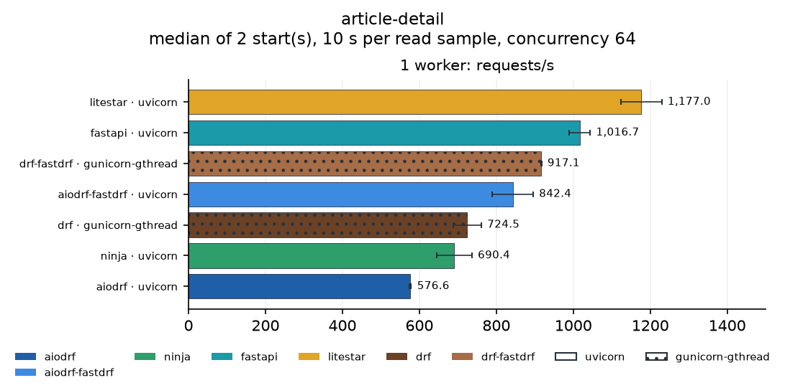
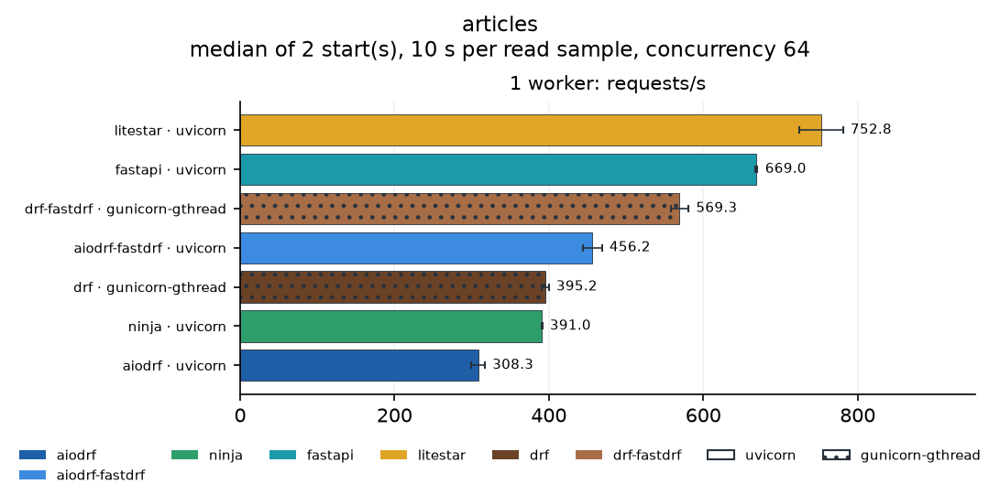
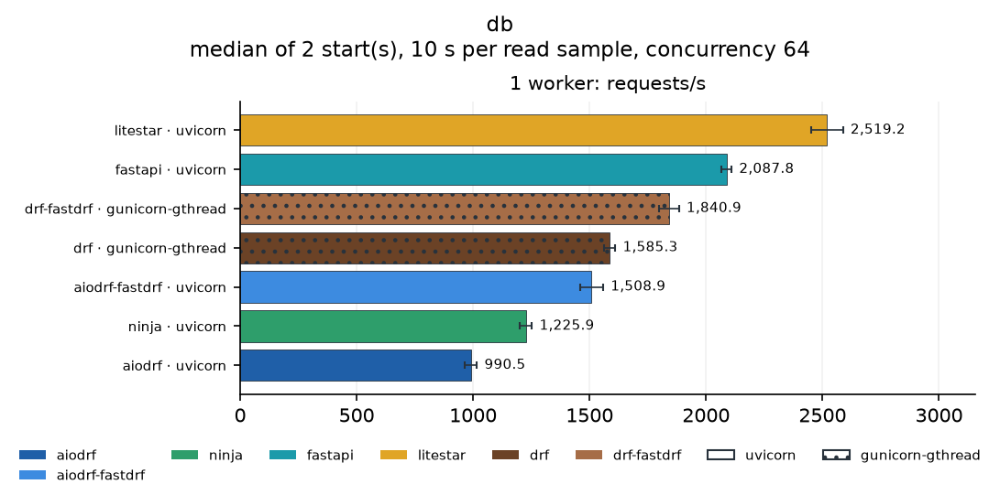
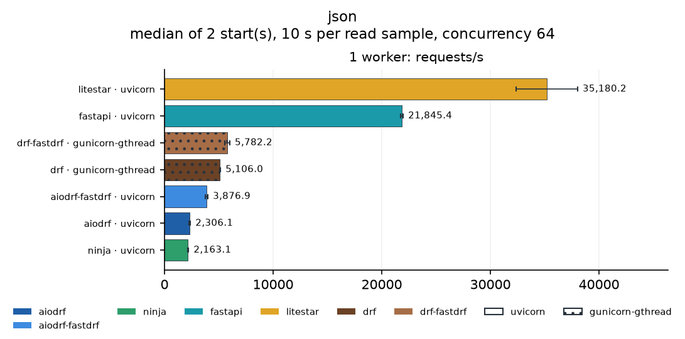
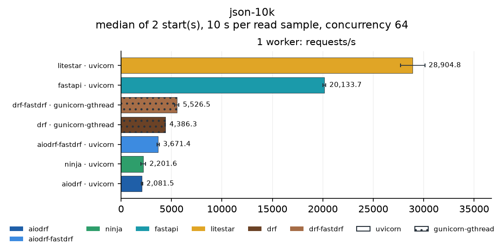
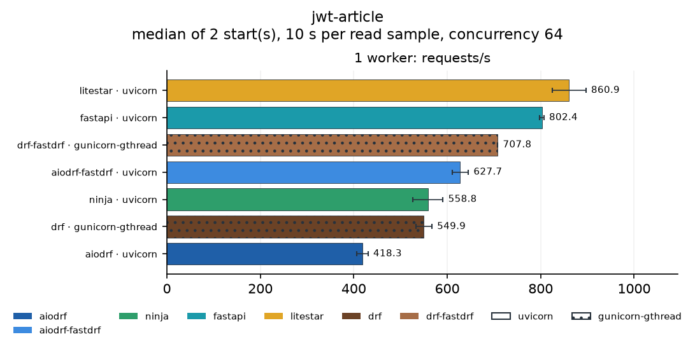
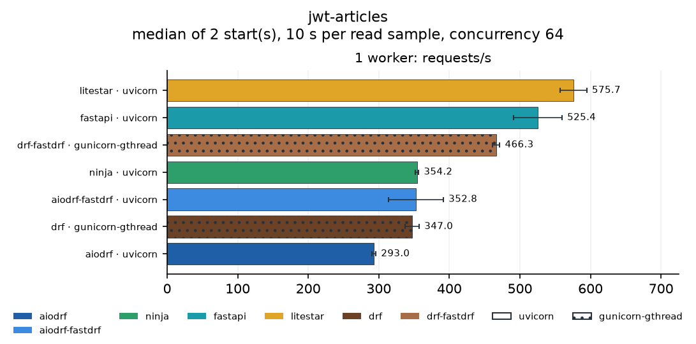

# Benchmark report: 2026-10-03-seven-profiles-1w

Archived run. [Current README and report](../../README.md).

State: **complete**. 7 server configurations (7 framework/server pairs at 1 worker(s)), 8 scenarios, 2 independent start(s) each: 56 of 56 groups complete.

## Reading this report

- Every number is the median over independent server starts; *spread* is half the min–max range relative to the median.
- Configurations are `framework · server` at a worker count. Worker counts are separate results, never averaged; each worker has one dedicated CPU.
- *Busiest service* is the external service (PostgreSQL, Elasticsearch, MongoDB, Valkey, HTTP fixture) with the highest CPU use during the sample, relative to the CPUs it has. At 80% or more (⚠) the service, not the framework, may have limited throughput.
- CPU % is the server process tree's mean CPU (100 % = one CPU). *Load generator* is oha's CPU use relative to the CPUs it has; at 80% or more (⚠) the load generator may have limited throughput.
- An *invalid* group had a failed verification, an HTTP error or a server error; it is not ranked.

## Overview

Throughput relative to the fastest configuration of each scenario at the same worker count (1 = fastest).

### Fastest configuration per scenario

| Scenario | 1 worker(s) |
| --- | --- |
| [article-create](#article-create) | litestar · uvicorn (551) |
| [article-detail](#article-detail) | litestar · uvicorn (1,177) |
| [articles](#articles) | litestar · uvicorn (753) |
| [db](#db) | litestar · uvicorn (2,519) |
| [json](#json) | litestar · uvicorn (35,180) |
| [json-10k](#json-10k) | litestar · uvicorn (28,905) |
| [jwt-article](#jwt-article) | litestar · uvicorn (861) |
| [jwt-articles](#jwt-articles) | litestar · uvicorn (576) |

## Service headroom

The highest CPU utilization any external service reached in each scenario, over all configurations.

| Scenario | Service | Utilization | Configuration |
| --- | --- | ---: | --- |
| article-create | postgres | 18% | drf-fastdrf · gunicorn-gthread · 1w |
| article-detail | postgres | 19% | litestar · uvicorn · 1w |
| articles | postgres | 22% | litestar · uvicorn · 1w |
| db | postgres | 14% | litestar · uvicorn · 1w |
| json | pgbouncer | 2% | aiodrf-fastdrf · uvicorn · 1w |
| json-10k | pgbouncer | 2% | drf · gunicorn-gthread · 1w |
| jwt-article | postgres | 18% | litestar · uvicorn · 1w |
| jwt-articles | postgres | 20% | litestar · uvicorn · 1w |

No service reached 80% in any group.

### Load generator

oha stayed below 80% of its CPUs in every group.

## Scenarios

### article-create

Validate input, insert an article with two tags in a transaction, read it back.

| Framework | Server | 1w req/s | 1w spread | 1w p99 ms | 1w CPU % | 1w busiest service | 1w load generator |
| --- | --- | ---: | ---: | ---: | ---: | --- | ---: |
| litestar | uvicorn | 551 | ±0.5% | 164.5 | 98 | postgres 11% | 0% |
| fastapi | uvicorn | 522 | ±0.3% | 242.2 | 99 | postgres 10% | 0% |
| drf-fastdrf | gunicorn-gthread | 421 | ±0.5% | 186.6 | 98 | postgres 18% | 0% |
| aiodrf-fastdrf | uvicorn | 389 | ±0.4% | 194.2 | 99 | postgres 17% | 0% |
| drf | gunicorn-gthread | 362 | ±0.4% | 209.5 | 99 | postgres 16% | 0% |
| ninja | uvicorn | 356 | ±0.1% | 228.2 | 98 | postgres 16% | 0% |
| aiodrf | uvicorn | 306 | ±1.4% | 284.6 | 99 | postgres 14% | 0% |

### article-detail

One article with author and tags.

| Framework | Server | 1w req/s | 1w spread | 1w p99 ms | 1w CPU % | 1w busiest service | 1w load generator |
| --- | --- | ---: | ---: | ---: | ---: | --- | ---: |
| litestar | uvicorn | 1,177 | ±4.5% | 103.2 | 98 | postgres 19% | 0% |
| fastapi | uvicorn | 1,017 | ±2.7% | 132.5 | 99 | postgres 17% | 0% |
| drf-fastdrf | gunicorn-gthread | 917 | ±0.0% | 86.3 | 99 | postgres 12% | 0% |
| aiodrf-fastdrf | uvicorn | 842 | ±6.3% | 125.9 | 99 | postgres 12% | 0% |
| drf | gunicorn-gthread | 724 | ±5.0% | 130.1 | 99 | postgres 10% | 0% |
| ninja | uvicorn | 690 | ±6.7% | 159.5 | 98 | postgres 11% | 0% |
| aiodrf | uvicorn | 577 | ±0.3% | 161.2 | 98 | postgres 8% | 0% |

### articles

Twenty articles with author and tags (join and prefetch) and the total count.

| Framework | Server | 1w req/s | 1w spread | 1w p99 ms | 1w CPU % | 1w busiest service | 1w load generator |
| --- | --- | ---: | ---: | ---: | ---: | --- | ---: |
| litestar | uvicorn | 753 | ±3.7% | 137.9 | 99 | postgres 22% | 0% |
| fastapi | uvicorn | 669 | ±0.2% | 190.8 | 99 | postgres 20% | 0% |
| drf-fastdrf | gunicorn-gthread | 569 | ±2.0% | 136.5 | 98 | postgres 14% | 0% |
| aiodrf-fastdrf | uvicorn | 456 | ±2.7% | 196.3 | 99 | postgres 12% | 0% |
| drf | gunicorn-gthread | 395 | ±1.1% | 227.6 | 100 | postgres 11% | 0% |
| ninja | uvicorn | 391 | ±0.1% | 233.1 | 98 | postgres 11% | 0% |
| aiodrf | uvicorn | 308 | ±2.8% | 276.5 | 98 | postgres 9% | 0% |

### db

Ten authors from PostgreSQL, ordered.

| Framework | Server | 1w req/s | 1w spread | 1w p99 ms | 1w CPU % | 1w busiest service | 1w load generator |
| --- | --- | ---: | ---: | ---: | ---: | --- | ---: |
| litestar | uvicorn | 2,519 | ±2.7% | 34.1 | 99 | postgres 14% | 1% |
| fastapi | uvicorn | 2,088 | ±1.0% | 66.8 | 99 | postgres 12% | 0% |
| drf-fastdrf | gunicorn-gthread | 1,841 | ±2.3% | 42.6 | 99 | postgres 7% | 0% |
| drf | gunicorn-gthread | 1,585 | ±1.6% | 69.0 | 99 | postgres 6% | 0% |
| aiodrf-fastdrf | uvicorn | 1,509 | ±3.3% | 55.2 | 99 | postgres 6% | 0% |
| ninja | uvicorn | 1,226 | ±2.1% | 96.9 | 98 | postgres 5% | 0% |
| aiodrf | uvicorn | 991 | ±2.6% | 115.9 | 99 | postgres 5% | 0% |

### json

A small JSON object, encoded on every request.

| Framework | Server | 1w req/s | 1w spread | 1w p99 ms | 1w CPU % | 1w busiest service | 1w load generator |
| --- | --- | ---: | ---: | ---: | ---: | --- | ---: |
| litestar | uvicorn | 35,180 | ±8.0% | 2.9 | 97 | mongodb 2% | 4% |
| fastapi | uvicorn | 21,845 | ±0.5% | 4.8 | 99 | mongodb 2% | 3% |
| drf-fastdrf | gunicorn-gthread | 5,782 | ±3.6% | 42.5 | 99 | mongodb 2% | 1% |
| drf | gunicorn-gthread | 5,106 | ±0.7% | 46.2 | 99 | pgbouncer 2% | 1% |
| aiodrf-fastdrf | uvicorn | 3,877 | ±2.5% | 54.9 | 98 | pgbouncer 2% | 1% |
| aiodrf | uvicorn | 2,306 | ±2.8% | 74.5 | 99 | pgbouncer 2% | 0% |
| ninja | uvicorn | 2,163 | ±1.8% | 87.4 | 99 | pgbouncer 2% | 0% |

### json-10k

A 10 KiB JSON object, encoded on every request.

| Framework | Server | 1w req/s | 1w spread | 1w p99 ms | 1w CPU % | 1w busiest service | 1w load generator |
| --- | --- | ---: | ---: | ---: | ---: | --- | ---: |
| litestar | uvicorn | 28,905 | ±4.2% | 3.5 | 97 | mongodb 2% | 4% |
| fastapi | uvicorn | 20,134 | ±0.7% | 4.6 | 99 | pgbouncer 2% | 3% |
| drf-fastdrf | gunicorn-gthread | 5,526 | ±4.0% | 44.2 | 98 | mongodb 2% | 1% |
| drf | gunicorn-gthread | 4,386 | ±0.6% | 53.2 | 99 | pgbouncer 2% | 1% |
| aiodrf-fastdrf | uvicorn | 3,671 | ±3.1% | 57.6 | 98 | pgbouncer 2% | 1% |
| ninja | uvicorn | 2,202 | ±10.8% | 80.6 | 97 | mongodb 2% | 0% |
| aiodrf | uvicorn | 2,082 | ±2.8% | 87.9 | 98 | pgbouncer 2% | 0% |

### jwt-article

Bearer JWT, the user loaded from PostgreSQL, then one article.

| Framework | Server | 1w req/s | 1w spread | 1w p99 ms | 1w CPU % | 1w busiest service | 1w load generator |
| --- | --- | ---: | ---: | ---: | ---: | --- | ---: |
| litestar | uvicorn | 861 | ±4.1% | 124.4 | 98 | postgres 18% | 0% |
| fastapi | uvicorn | 802 | ±0.5% | 158.0 | 98 | postgres 17% | 0% |
| drf-fastdrf | gunicorn-gthread | 708 | ±0.0% | 108.1 | 98 | postgres 12% | 0% |
| aiodrf-fastdrf | uvicorn | 628 | ±2.8% | 136.8 | 98 | postgres 11% | 0% |
| ninja | uvicorn | 559 | ±5.7% | 166.8 | 98 | postgres 11% | 0% |
| drf | gunicorn-gthread | 550 | ±3.1% | 159.5 | 99 | postgres 10% | 0% |
| aiodrf | uvicorn | 418 | ±2.9% | 191.8 | 99 | postgres 8% | 0% |

### jwt-articles

Bearer JWT and user, then the second page of twenty articles.

| Framework | Server | 1w req/s | 1w spread | 1w p99 ms | 1w CPU % | 1w busiest service | 1w load generator |
| --- | --- | ---: | ---: | ---: | ---: | --- | ---: |
| litestar | uvicorn | 576 | ±3.3% | 179.9 | 100 | postgres 20% | 0% |
| fastapi | uvicorn | 525 | ±6.5% | 246.3 | 99 | postgres 19% | 0% |
| drf-fastdrf | gunicorn-gthread | 466 | ±1.1% | 160.4 | 99 | postgres 13% | 0% |
| ninja | uvicorn | 354 | ±0.6% | 224.3 | 99 | postgres 11% | 0% |
| aiodrf-fastdrf | uvicorn | 353 | ±10.9% | 258.4 | 99 | postgres 12% | 0% |
| drf | gunicorn-gthread | 347 | ±2.9% | 254.7 | 100 | postgres 11% | 0% |
| aiodrf | uvicorn | 293 | ±0.9% | 266.3 | 99 | postgres 9% | 0% |

## Parameters

- Frameworks: fastapi, litestar, ninja, drf, drf-fastdrf, aiodrf, aiodrf-fastdrf
- Servers: uvicorn, gunicorn-gthread; workers: [1]
- Scenarios: 8
- Server CPUs: [0]; load generator CPUs: [8, 9, 10, 11, 12, 13, 14, 15]
- Repeats: 2; read duration: 10 s; warmup: 2 s
- Concurrency: 64; load threads: 2; requests per write sample: 3000
- Dataset: 1000 articles; profile order seed: 42
- Started: 2026-10-03T19:39:18.241672+00:00; finished: 2026-10-03T20:04:59.572588+00:00
- Load generator: oha 1.16.0

## Environment

- Python: 3.14.7 (main, Sep  1 2026, 14:18:09) [Clang 22.1.3 ]; GIL enabled: True
- Host: Intel(R) Core(TM) i7-14700F, 28 logical CPUs, 123.3 GiB; CPU frequency governor: powersave
- Platform: Linux-7.0.0-31-generic-x86_64-with-glibc2.43
- Packages: Django 6.1.1, django-aiodrf 0.0.4, django-fastdrf 0.5.0, aiodrf-asgi-lifespan 0.1.1, djangorestframework 3.18.1, adrf 0.1.14, django-ninja 1.7.1, django-bolt 0.11.1, fastapi 0.142.2, litestar 2.24.0, pydantic 2.13.5, msgspec 0.22.0, uvicorn 0.54.0, granian 2.8.4, gunicorn 26.2.0, gevent 26.9.0, uvloop 0.22.1, psycopg 3.3.6
- Source aiodrf: `f6a72037c3ad` (commit a159adbd83fa3cd259b470483552854a3b5ea211, working tree clean)
- Source benchmark: `d43df68dc9da` (commit a159adbd83fa3cd259b470483552854a3b5ea211, working tree modified)
- Source fastdrf: `63f32eee6b29` (commit a159adbd83fa3cd259b470483552854a3b5ea211, working tree clean)

## Profile configuration

| Profile | ORM | Serializer backend | AIODRF options |
| --- | --- | --- | --- |
| aiodrf | Django ORM (psycopg) | drf | `{}` |
| aiodrf-fastdrf | Django ORM (psycopg) | msgspec | `{"REPRESENTATION_MODE": "inline", "REQUEST_THREADS": 32}` |
| drf | Django ORM (psycopg) | drf | `{}` |
| drf-fastdrf | Django ORM (psycopg) | msgspec | `{}` |
| fastapi | SQLAlchemy async (psycopg) | Pydantic | `{}` |
| litestar | SQLAlchemy async (psycopg) | msgspec Struct | `{}` |
| ninja | Django ORM (psycopg) | Pydantic | `{}` |

Full parser, renderer and fastdrf settings are in `manifest.json`. SQLAlchemy uses a request-scoped AsyncSession and a worker-scoped async pool; Django uses its psycopg pool. SQL text and transaction management differ between ORMs.

- PostgreSQL: server_version 18.6 (Debian 18.6-1.pgdg12+2), route direct, shared_buffers 512MB, synchronous_commit off, max_connections 400; application pool {'max_size': 10, 'min_size': 1, 'timeout': 10}

Server commands:

- aiodrf-fastdrf-uvicorn-w1: `/home/ctolon/aiodrf/forks/aiodrf-benchmarks/.venv/bin/python -m uvicorn bench.asgi:application --host 127.0.0.1 --port 8100 --workers 1 --loop uvloop --http httptools --ws none --lifespan on --backlog 2048 --timeout-keep-alive 5 --no-access-log --log-level warning`
- aiodrf-uvicorn-w1: `/home/ctolon/aiodrf/forks/aiodrf-benchmarks/.venv/bin/python -m uvicorn bench.asgi:application --host 127.0.0.1 --port 8100 --workers 1 --loop uvloop --http httptools --ws none --lifespan on --backlog 2048 --timeout-keep-alive 5 --no-access-log --log-level warning`
- drf-fastdrf-gunicorn-gthread-w1: `/home/ctolon/aiodrf/forks/aiodrf-benchmarks/.venv/bin/python -m gunicorn bench.wsgi:create_application() --bind 127.0.0.1:8100 --workers 1 --worker-class gthread --threads 8 --worker-connections 256 --backlog 2048 --keep-alive 5 --timeout 60 --graceful-timeout 10 --log-level warning --error-logfile - --config python:bench.gunicorn_config`
- drf-gunicorn-gthread-w1: `/home/ctolon/aiodrf/forks/aiodrf-benchmarks/.venv/bin/python -m gunicorn bench.wsgi:create_application() --bind 127.0.0.1:8100 --workers 1 --worker-class gthread --threads 8 --worker-connections 256 --backlog 2048 --keep-alive 5 --timeout 60 --graceful-timeout 10 --log-level warning --error-logfile - --config python:bench.gunicorn_config`
- fastapi-uvicorn-w1: `/home/ctolon/aiodrf/forks/aiodrf-benchmarks/.venv/bin/python -m uvicorn bench.asgi:application --host 127.0.0.1 --port 8100 --workers 1 --loop uvloop --http httptools --ws none --lifespan on --backlog 2048 --timeout-keep-alive 5 --no-access-log --log-level warning`
- litestar-uvicorn-w1: `/home/ctolon/aiodrf/forks/aiodrf-benchmarks/.venv/bin/python -m uvicorn bench.asgi:application --host 127.0.0.1 --port 8100 --workers 1 --loop uvloop --http httptools --ws none --lifespan on --backlog 2048 --timeout-keep-alive 5 --no-access-log --log-level warning`
- ninja-uvicorn-w1: `/home/ctolon/aiodrf/forks/aiodrf-benchmarks/.venv/bin/python -m uvicorn bench.asgi:application --host 127.0.0.1 --port 8100 --workers 1 --loop uvloop --http httptools --ws none --lifespan on --backlog 2048 --timeout-keep-alive 5 --no-access-log --log-level warning`

## Files

`summary.csv` holds every group's numbers; `samples.json` every sample; each case directory the load generator output, server log, resource samples and verification record; `manifest.json` the complete environment.
